  <a href="README.md">简体中文</a> · <b>English</b>

  <picture>
    <source media="(prefers-color-scheme: dark)" srcset="docs/images/header-en-dark.svg" />
    
  </picture>

  
  
  
  

Type4Me is a free, open-source voice input app for macOS. Hold a hotkey and talk — text streams in at your cursor as you speak. The same hotkey workflow can polish what you said, translate it, ask AI about it, or turn it into a Mac action. You choose the speech engine, the LLM and the prompts; your history stays on your Mac and can be exported anytime.

## Download

| Edition | Details | Size |
| --- | --- | --- |
| ✨ **[Cloud (recommended)](https://github.com/joewongjc/type4me/releases/download/v2.10.0/Type4Me-v2.10.0-cloud.dmg)** | Intel and Apple Silicon. Bring your own speech and LLM API keys; Volcano Engine (Doubao) or Soniox recommended for recognition. [Setup guide](https://my.feishu.cn/wiki/QdEnwBMfUi0mN4k3ucMcNYhUnXr) | ~14 MB |
| **[Local](https://github.com/joewongjc/type4me/releases/download/v2.10.0/Type4Me-v2.10.0-local-apple-silicon.dmg)** | Apple Silicon only. Bundles SenseVoice + Qwen3-ASR for offline recognition (~8 GB RAM, 32 GB+ Macs recommended). Text processing still needs an API key or local Ollama | ~720 MB |

Requires macOS 14 (Sonoma) or later. Both editions share the same settings, so you can switch anytime. The app is notarized by Apple; on first launch, grant **Microphone** and **Accessibility** access as prompted.

## Demo

<video src="https://github.com/user-attachments/assets/d5ad6da9-b924-4fd6-9812-d0d9868563a4" width="720" controls>Type4Me demo video</video>

Each mode can have several global hotkeys, and each hotkey can be hold-to-talk or press-to-toggle.

## Built-in modes + your own

| Mode | What it does |
| --- | --- |
| **Quick Mode** | ⚡️ Speech recognition only — the fastest path |
| **Intelli Sense** | Your everyday mode: handles self-corrections, drops filler words, and adapts wording to the current app and context |
| **Translation** | Translates automatically into any of 18 target languages |
| **Ask Anything** | Select text anywhere and ask about it by voice; follow-ups are kept as conversations |
| **Mac Actions** | "Open Safari", "Volume to 30", "Lock screen" — said and done |
| **Voice Polish** | Turns speech into clean written text with a consistent, predictable style |
| **Prompt Optimization** | Expands a one-line request into a well-structured prompt for ChatGPT or Claude |
| **Task Delegation** | Combines your voice, the selection and the clipboard to produce a finished result |

Not sure which one to use? Start with **Intelli Sense**. You can also create your own modes: prompt templates accept `{text}` (what you said), `{selected}` (selected text) and `{clipboard}`, so any text workflow can live behind one hotkey. When you can't talk, the manual input hotkey lets you type instead and still run any mode.

Examples and use cases for each mode: [Modes & Features](docs/usage/modes.en.md).

## Extended features

- **Local and cloud recognition**: the Local edition runs SenseVoice + Qwen3-ASR on your Mac, completely free; in the cloud, choose from 15 services including Volcano Engine (Doubao), Soniox and OpenAI.
- **Any LLM**: Doubao, DeepSeek, Kimi, Zhipu, MiniMax, Xiaomi MiMo, OpenAI, Claude, Gemini, OpenRouter, or Ollama and any OpenAI-compatible endpoint.
- **Voice Revise**: Spotted a mistake? Press `Fn` + `R` and say "make it 2 PM" — only that part changes, and you can undo by button or voice.
- **Vocabulary**: hotwords improve recognition of names and jargon; snippets expand phrases like "my email" into the real address. With [type4me-vocab-skill](https://github.com/joewongjc/type4me-vocab-skill) installed, tell your AI agent "don't transcribe Qwen3.5 as Queen 3.5" and it maintains your vocabulary for you.
- **Menu bar control center**: see recording status and switch mode, microphone, speech engine, LLM and translation target from the menu bar.
- **History & usage**: every raw transcript and processed result is saved, searchable and exportable to CSV; the usage dashboard tracks tokens, estimated cost and latency per model. The home page shows time spoken, word count and an activity heatmap.
- **Local backups**: history, modes, vocabulary, hotkeys and settings are snapshotted daily; the latest seven are kept.
- **URL Scheme**: drive recording from Stream Deck, Shortcuts, Raycast, Alfred or scripts with commands like `type4me://toggle`, without stealing focus. See the [command reference](docs/usage/url-scheme.en.md).

## Screenshots

<table>
  <tr>
    <td width="50%"></td>
    <td width="50%"></td>
  </tr>
  <tr>
    <td></td>
    <td></td>
  </tr>
</table>

## Tips

- **Use a cloud speech engine**: it's cheap. About 50,000 characters (5 hours) of heavy use cost the author roughly ¥5 (~$0.70), and Volcano Engine gives new users 40 free hours. Local models work, but they use a lot of memory and SenseVoice is weak on English words.
- **Pick a small, non-reasoning LLM**: cleaning up text doesn't need reasoning. The author uses Seed-2.0-lite; models whose thinking can't be turned off (e.g. MiniMax M2.7) are much slower. If processing feels slow, open an Issue with your provider and model.
- **Install the vocabulary Skill**: every voice input tool struggles with proper nouns. After a day or two with the [Skill](https://github.com/joewongjc/type4me-vocab-skill), your recurring mistakes are fixed for good.

## Why Type4Me

Every voice input tool I tried had at least one of these problems: expensive ($30/month), closed (no history export), rigid (no custom prompts), or slow (forced rewriting plus network latency).

As a former fan of the priciest one, my feeling was always: **"How can it be this good and this frustrating at the same time?"** And not everything you say needs to sound polished.

## Contributing

Issues and PRs are welcome. I built the whole project with Claude Code, and I never drop anyone's contribution — even if a PR has bugs, we merge first and fix later.

Building from source, code signing and architecture are covered in [CONTRIBUTING.md](CONTRIBUTING.md); design docs start at [docs/README.md](docs/README.md). To have an AI agent deploy from source, just give it this repository's link.

## Acknowledgments

[SenseVoice](https://github.com/FunAudioLLM/SenseVoice) · [streaming-sensevoice](https://github.com/pengzhendong/streaming-sensevoice) · [asr-decoder](https://github.com/pengzhendong/asr-decoder) · [sherpa-onnx](https://github.com/k2-fsa/sherpa-onnx) · [Qwen3-ASR](https://github.com/QwenLM/Qwen3-ASR) · [mlx-qwen3-asr](https://github.com/moona3k/mlx-qwen3-asr)

## Star History

<a href="https://star-history.dera.page/#joewongjc/type4me&type=date&legend=top-left">
  <picture>
    <source media="(prefers-color-scheme: dark)" srcset="https://star-history.dera.page/svg?repos=joewongjc%2Ftype4me&type=date&theme=dark&legend=top-left" />
    
  </picture>
</a>

## License

[MIT License](LICENSE)
