  <b>简体中文</b> · <a href="README.en.md">English</a>

  <picture>
    <source media="(prefers-color-scheme: dark)" srcset="docs/images/header-dark.svg" />
    
  </picture>

  
  
  
  

Type4Me 是一款免费开源的 macOS 语音输入法。按下快捷键说话，文字边说边出现在光标处；同一段话还可以一键润色、翻译、向 AI 提问，或者直接操作 Mac。识别引擎、大模型和 Prompt 都由你选，历史记录存在本机，随时可以导出。

## 下载

| 版本 | 说明 | 大小 |
| --- | --- | --- |
| ✨ **[云端版（推荐）](https://github.com/joewongjc/type4me/releases/download/v2.10.0/Type4Me-v2.10.0-cloud.dmg)** | Intel 与 Apple Silicon 通用。需要自备语音识别和大模型的 API Key，识别推荐火山引擎（豆包）或 Soniox。[配置指引](https://my.feishu.cn/wiki/QdEnwBMfUi0mN4k3ucMcNYhUnXr) | ~14 MB |
| **[本地版](https://github.com/joewongjc/type4me/releases/download/v2.10.0/Type4Me-v2.10.0-local-apple-silicon.dmg)** | 仅支持 Apple Silicon。内置 SenseVoice + Qwen3-ASR 离线识别，约占 8 GB 内存，建议 32 GB 以上的机器使用；文本处理仍需 API Key 或本地 Ollama | ~720 MB |

需要 macOS 14 (Sonoma) 及以上。两个版本共用一份配置，可以随时互相替换。安装包已通过 Apple 公证，首次打开按引导授予**麦克风**和**辅助功能**权限就能用。

## 演示

<video src="https://github.com/user-attachments/assets/d5ad6da9-b924-4fd6-9812-d0d9868563a4" width="720" controls>Type4Me 演示视频</video>

每个模式可以绑定多个全局快捷键，每个快捷键单独设为「按住说话」或「按一下开关」。

## 内置模式 + 自由定义

| 模式 | 用途 |
| --- | --- |
| **快速模式** | ⚡️仅做语音识别，速度最快 |
| **智能感知** | 日常主力模式，支持改口、去掉口头禅，并参考当前 App 和上下文调整措辞 |
| **翻译模式** | 自动翻译成18 种目标语言中的任意一种 |
| **随便问** | 选中屏幕上的文字，直接语音提问；支持连续追问，会话会保存下来 |
| **Mac 操作** | 说一句「打开 Safari」「音量调到 30」「锁屏」就能执行 |
| **语音润色** | 按固定规则把口语整理成书面文字，输出风格稳定 |
| **Prompt 优化** | 把一句需求扩写成完整的 Prompt，适合发给 ChatGPT、Claude |
| **代办模式** | 结合语音、选中文字和剪贴板，直接生成可用的成品 |

拿不准用哪个，就用**智能感知**。你也可以新建模式：Prompt 模板里可以用 `{text}`（本次语音）、`{selected}`（选中的文字）、`{clipboard}`（剪贴板）三个变量，把任意文本处理流程绑到一个快捷键上。不方便说话的时候，按手动输入快捷键直接打字，同样可以调用这些模式。

各模式的示例和适用场景见 [模式与功能详解](docs/usage/modes.md)。

## 功能扩展

- **本地、云端语音识别**：下载本地版，可用 SenseVoice + Qwen3-ASR进行识别，完全免费；云端支持火山引擎（豆包）、Soniox、OpenAI 等 15 家服务。
- **大模型随意换**：豆包、DeepSeek、Kimi、智谱、MiniMax、小米 MiMo、OpenAI、Claude、Gemini、OpenRouter，也可以接 Ollama 或任意 OpenAI 兼容接口。
- **语音改口**：刚输入的文字有错，按 `Fn` + `R` 说「改成下午 2 点」，只改那一处，可以一键或用语音撤销。
- **词汇管理**：热词提高专有名词的识别率，片段替换可以把「我的邮箱」换成真实地址。装上 [type4me-vocab-skill](https://github.com/joewongjc/type4me-vocab-skill) 后，对 AI Agent 说一句「Qwen3.5 不要识别成 Queen 3.5」，它会帮你把词库维护好。
- **菜单栏控制中心**：在菜单栏查看录音状态，切换模式、麦克风、识别引擎、文本处理模型和翻译目标语言。
- **历史与用量**：保存每次的原始识别和处理结果，支持搜索和导出 CSV；用量看板按模型统计 Token、预估费用和耗时。首页显示输入时长、字数和活跃热力图。
- **本地备份**：每天自动备份历史、模式、词汇、快捷键和配置，保留最近 7 份。
- **URL Scheme**：用 `type4me://toggle` 等命令接入 Stream Deck、快捷指令、Raycast、Alfred 或脚本，后台调用不会抢走焦点。见 [命令参考](docs/usage/url-scheme.md)。

## 界面预览

<table>
  <tr>
    <td width="50%"></td>
    <td width="50%"></td>
  </tr>
  <tr>
    <td></td>
    <td></td>
  </tr>
</table>

## 使用建议

- **识别用云端引擎**：费用很低。作者高强度用了约 5 万字（5 小时），花了 5 块钱左右，火山引擎新用户还送 40 小时。本地模型效果不错，但很吃内存，而且 SenseVoice 识别英文单词偏弱。
- **大模型选轻量、不带思考的**：整理文字用不上推理。作者自己用 Seed-2.0-lite；关不掉思考的模型（比如 MiniMax M2.7）会慢很多。如果你觉得处理慢，欢迎在 Issue 里告诉我用的是哪家、哪个模型。
- **装上词库 Skill**：专有名词识别不准，是所有语音输入法的通病。配合 [Skill](https://github.com/joewongjc/type4me-vocab-skill) 用上一两天，常见的错词基本都能纠正过来。

## 为什么做 Type4Me

市面上的语音输入法，至少有下面一个问题：贵（$30/月）、封闭（记录导不出来）、改不了（不能自定义 Prompt）、慢（强制优化加上网络延迟）。

作为某款最贵识别工具的前粉丝，我的感受一直是：**「它怎么可以这么好用，又这么难用」**。况且，也不是每句话都需要说得工工整整。

## 参与贡献

欢迎提交 Issue 和 PR。这个项目全部是我用 Claude Code 写的；收到 PR，哪怕有 bug，我也不会漏掉任何人的贡献，合并之后再改就好。

从源码构建、签名和架构说明见 [CONTRIBUTING.md](CONTRIBUTING.md)，设计文档从 [docs/README.md](docs/README.md) 进入。想让 AI Agent 帮你从源码部署，把这个仓库的链接发给它就行。

## 致谢

[SenseVoice](https://github.com/FunAudioLLM/SenseVoice) · [streaming-sensevoice](https://github.com/pengzhendong/streaming-sensevoice) · [asr-decoder](https://github.com/pengzhendong/asr-decoder) · [sherpa-onnx](https://github.com/k2-fsa/sherpa-onnx) · [Qwen3-ASR](https://github.com/QwenLM/Qwen3-ASR) · [mlx-qwen3-asr](https://github.com/moona3k/mlx-qwen3-asr)

## Star History

<a href="https://star-history.dera.page/#joewongjc/type4me&type=date&legend=top-left">
  <picture>
    <source media="(prefers-color-scheme: dark)" srcset="https://star-history.dera.page/svg?repos=joewongjc%2Ftype4me&type=date&theme=dark&legend=top-left" />
    
  </picture>
</a>

## 许可证

[MIT License](LICENSE)
