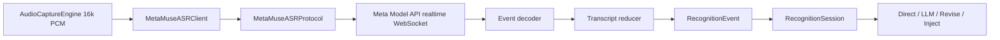

# Type4Me Meta Muse Voice Transcribe 开发设计

> 分支：`feat/meta-muse-asr`
> 文档类型：开发设计
> 文档状态：当前有效（已实现，持续验证）
> 最后校验：2026-09-05
> 实现基线：`6fdfb8d`
> 对应产品设计：`docs/features/meta-muse-asr/product-design.md`
> 设计日期：2026-09-03
> 目标模型：Muse Voice Transcribe
> 官方研究发布：https://research.meta.ai/blog/introducing-muse-voice-transcribe

## 1. 设计摘要

Muse Voice Transcribe 应作为 Type4Me 的标准 realtime streaming ASR Provider 接入，而不是 Batch Provider 或新的音频子系统。

当前 Type4Me 已具备需要的主要抽象：`ASRProvider`、`ASRProviderConfig`、`ASRProviderRegistry`、`.streaming()` capability、`SpeechRecognizer` 生命周期、`RecognitionTranscript` partial/final 模型、`ASRRequestOptions.hotwords`、credential validator、`URLSessionWebSocketTask` 实现样例，以及统一 16 kHz mono Int16 PCM 音频。

核心技术原则：

1. Provider capability = `.streaming()`；
2. 第一版采用 Push-to-Talk 会话语义；
3. 不启用 diarization，不让 endpointing 控制录音生命周期；
4. Type4Me hotwords 映射到 Muse keyword biasing；
5. context biasing 第一版不发送；
6. 复用现有 16 kHz mono s16le PCM；
7. WebSocket 完成真实远程握手后才算 ready；
8. partial transcript 按“替换当前假设”处理，不盲目 append；
9. API wire schema 在编码前必须重新对照 Meta 官方 Developer Reference；
10. 快速变化字段集中隔离在 `MetaMuseASRProtocol`。

## 2. 当前架构适配

### 2.1 Registry

当前 `ASRProviderRegistry.ProviderEntry` 已包含 Config、Client factory、capabilities 和可选 `validateCredentials`。Muse 不需要扩展 Registry 公共模型。

目标 capability：

```swift
capabilities: .streaming()
```

这会自动得到 `isStreaming == true` 与 `supportsRealtimeRecognition == true`。

### 2.2 SpeechRecognizer

当前接口：

```swift
connect(config:options:)
sendAudio(_:)
endAudio()
disconnect()
events
```

与 realtime WebSocket 生命周期一一对应，无需新增协议方法。

### 2.3 AudioCaptureEngine

当前统一输出：

```text
sample rate: 16000 Hz
channels: 1
format: signed Int16 PCM
chunk duration: 200 ms
chunk size: 6400 bytes
```

公开 Muse launch developer references 一致描述 realtime API 接受 16/24 kHz mono s16le PCM，因此第一版原则上可以直接发送 Type4Me PCM，不增加转码。

### 2.4 WebSocket 工程模板

`DeepgramASRClient` 已解决 `URLSessionWebSocketTask`、delegate、handshake gate、receive loop、异常 close tracking、proxy-aware URLSession、partial/final 去重与 clean disconnect。Muse 应复用工程模式，但使用独立 wire protocol。

### 2.5 Settings

当前 `ASRProviderDetailView` 已支持动态 Config 字段、Registry credential validation、guide links、provider note，并根据 capability 自动显示“实时流式 / Batch”。Muse 不需要独立设置页面。

## 3. 外部 API 事实与可信度边界

### 3.1 Meta 官方研究页已确认

可直接作为稳定依据：

- realtime streaming ASR；
- 80 ms 模型内部 audio chunks；
- adaptive delay；
- endpointing；
- diarization 20+ speakers；
- code-switching；
- language / keyword / context biasing；
- 70+ training languages，25 extensively verified；
- long-audio model capability；
- Meta Model API 可用。

### 3.2 交叉 developer reference 信息

多个引用 Meta Developer Reference 的独立资料一致给出：

```text
model: muse-voice-transcribe-1.0
realtime: wss://api.meta.ai/v1/asr/realtime
file: POST https://api.meta.ai/v1/asr/transcribe
realtime audio: mono PCM s16le, 16 kHz or 24 kHz
modes: PUSH_TO_TALK / ENDPOINTING / DIARIZATION
single realtime session: launch docs report around 60 minutes
```

这些适合用于架构设计，但**不得直接当成最终 wire contract**。

### 3.3 Authentication 资料冲突

当前同步资料存在冲突：一类称 realtime auth 必须在 socket 建立后的首个 handshake/config frame 中发送；另一类示例仍在 WebSocket upgrade request 使用 Bearer header。

因此设计阶段不选择其中一种。

**开发 Gate A：编码 `connect()` 前，必须在 Meta 官方 Developer Console / API Reference 确认认证方式，并用最小 WebSocket 样例实测。**

## 4. 总体架构



| 组件 | 职责 |
|---|---|
| `MetaMuseASRConfig` | API Key、语言提示、固定模型/endpoint |
| `MetaMuseASRProtocol` | URL、session config、wire events、限制和错误解析 |
| `MetaMuseASRClient` | socket 生命周期、PCM 发送、receive loop、transcript state |
| `ASRProviderRegistry` | 注册 Config / Client / `.streaming()` |
| `ASRProviderDetailView` | links 与 provider note |

## 5. 文件规划

新增：

```text
Type4Me/ASR/MetaMuseASRClient.swift
Type4Me/ASR/Providers/MetaMuseASRConfig.swift
Type4Me/Protocol/MetaMuseASRProtocol.swift
Type4MeTests/MetaMuseASRConfigTests.swift
Type4MeTests/MetaMuseASRProtocolTests.swift
Type4MeTests/MetaMuseASRClientTests.swift   # 测试基础设施允许时
```

修改：

```text
Type4Me/ASR/ASRProvider.swift
Type4Me/ASR/ASRProviderRegistry.swift
Type4Me/UI/Settings/ASRProviderDetailView.swift
Type4MeTests/ASRProviderRegistryTests.swift
README.md
AGENTS.md
```

如图标需要显式映射，再修改 BrandIcon 相关文件；文档阶段不预设资源文件名。

## 6. Provider 标识

建议 enum：

```swift
case metaMuse
```

而不是 `.muse`，因为 Muse 是 Meta 的模型家族名称。

用户显示名：`Meta Muse`。

## 7. MetaMuseASRConfig

建议：

```swift
struct MetaMuseASRConfig: ASRProviderConfig, Sendable {
    static let provider = ASRProvider.metaMuse
    static let displayName = "Meta Muse"
    static let defaultModel = "muse-voice-transcribe-1.0"
    static let defaultRealtimeURL = "wss://api.meta.ai/v1/asr/realtime"

    let apiKey: String
    let languageBias: String
}
```

模型 ID 和 endpoint 只有通过 Gate A 后才能正式落代码常量。

### 7.1 Credential fields

第一版只有：

- `apiKey`：secure、required；
- `languageBias`：optional、default=`auto`。

具体 language code 必须由官方 reference 生成，不允许在 UI 中开放未经验证的任意值。

### 7.2 不暴露 Base URL

第一版不提供自定义 `baseURL`，避免把 Meta realtime authentication / WebSocket gateway 兼容性扩大为首发测试范围。企业 gateway 如有需求再单独设计。

## 8. Registry

目标注册：

```swift
.metaMuse: ProviderEntry(
    configType: MetaMuseASRConfig.self,
    createClient: { MetaMuseASRClient() },
    capabilities: .streaming()
)
```

若 `connect()` 本身完成真实 auth + session-ready，则现有默认 credential validation 的 `connect → disconnect` 已足够。若 Meta 把 credential validation 与 session 创建拆开，再增加 provider-specific validator。

## 9. Realtime Session 模式

### 9.1 Push-to-Talk

公开 developer reference 将首版需要的语义描述为 `PUSH_TO_TALK`。具体 wire enum 名在 Gate A 确认。

映射：

```text
connect   → create/configure Muse session
sendAudio → push PCM
endAudio  → tell Muse current input is complete
final     → freeze transcript
close     → disconnect WebSocket
```

### 9.2 ENDPOINTING

第一版不以 automatic endpointing 结束用户录音。若 Push-to-Talk 模式仍返回 speech boundary，可只用于内部 segment finalization。

### 9.3 DIARIZATION

第一版关闭。即使 response schema 带 speaker metadata，也不拼入 transcript。

## 10. MetaMuseASRClient 状态

建议 actor 保存：

```swift
webSocketTask
receiveTask
URLSession
sessionDelegate
connectionGate
closeTracker
eventContinuation
confirmedSegments
currentPartial
lastTranscript
didEndAudio
```

复用 Deepgram 的 gate / close-tracker 思路，但类型独立，避免协议行为耦合。

## 11. connect()

顺序：

1. cast `MetaMuseASRConfig`；
2. reset event stream 与 transcript state；
3. build URLRequest；
4. 创建 `options.urlSessionConfiguration` 的 URLSession；
5. open WebSocket；
6. 等待 socket upgrade（connectionGate）；
7. 启动 receive loop（开始接收并派发 incoming frames）；
8. 按官方协议发送 auth/session configuration；
9. 等待 server session-ready ack（readyGate）；
10. 只有此时 `connect()` 才正式返回成功。

不能仅以 `webSocketTask.resume()` 或 HTTP 101 upgrade 视为 credential success。

握手 timeout 建议从 5 秒起步，再按真实 API 调整。

## 12. Session Configuration

所有 wire field 由 `MetaMuseASRProtocol` 构造。逻辑配置概念：

```text
model = Muse Voice Transcribe launch model
mode = push-to-talk
audio = pcm_s16le / 16000 / mono
language bias = optional
keyword bias = ASRRequestOptions.hotwords
context bias = none
diarization = off
endpointing = not used for lifecycle
```

本文刻意不写死 JSON key，因为当前官方 reference 抓取不稳定且 auth 字段存在冲突。

## 13. Audio Streaming

Type4Me 原生音频：

```text
16000 samples/s × 2 bytes = 32000 bytes/s
200 ms = 3200 samples = 6400 bytes
```

Realtime 路径不加 WAV header、不 Base64；按官方协议发送 raw/binary PCM 或指定 audio frame。

### 13.1 200 ms 与 Muse 80 ms

Muse 模型内部 80 ms 决策不等于客户端必须 80 ms frame。第一版保持 Type4Me 全局 200 ms capture chunk，先测真实端到端 latency。

如果 200 ms 被证明是主要瓶颈，再评估：

- 全局改为 80~100 ms；或
- AudioCaptureEngine 支持 provider-requested chunk duration。

仅在 Client 收到 200 ms 后再切成 80 ms，无法消除采集阶段的前 200 ms 等待，因此不是完整优化。

## 14. Audio Pacing / Backpressure

公开 launch API 资料指出 realtime audio 需要接近实时速度发送，并限制 backlog；不能把长录音缓存后瞬间灌入 realtime socket。

Type4Me capture 天然按实时速度产生 PCM。Client 仍需要：

- `sendAudio()` await socket send；
- send error 立即终止 session；
- 不无限累积发送 Task；
- 不在 Client 长期缓存完整 PCM；
- backlog/rate error 映射为明确错误。

## 15. Hotword / Keyword Biasing

唯一来源：

```swift
ASRRequestOptions.hotwords
```

在 `connect()` 时快照并写入 session config，不在录音中途热更新。

如果 Meta 限制 keyword 数量、长度或总字符，统一在 Protocol sanitize，并加入测试。

禁止：

- 打印关键词正文；
- 映射 `boostingTableID`；
- 自动把历史 transcript 当 context bias。

## 16. Language Bias

推荐语义：

```text
auto → 不发送 language bias
specific → 发送一个官方支持的 language hint/bias
```

语言提示不能关闭 code-switching，也不允许用户手写未经验证的 code。

## 17. Context Biasing

Meta 官方确认支持 context biasing，但首版 Protocol 明确不发送。

不得自动读取：RecognitionSession 历史、PromptContext、Intelli Sense snapshot、clipboard 或 active window text。

未来如启用，必须单独更新产品隐私设计。

## 18. Receive Loop / Event Decoder

Protocol 只定义实现所需的最小 wire event：

```text
session ready/configured
partial transcript
final transcript / speech complete
turn identifier（如存在）
server error
session end / progress / usage（如存在）
```

未知且无关的 metadata event 可忽略；无法解析的 transcript/error event 必须报错。

公开开发资料指出某些 mode 的 turn completion 可能交错，因此 decoder 保留可选 turn ID，不假设所有完成事件严格顺序到达。

## 19. Transcript Reducer

公开资料描述 realtime partial 默认可能是 cumulative hypothesis，因此后一个 partial 替换当前假设：

```swift
currentPartial = newHypothesis
```

不能默认：

```swift
currentPartial += newHypothesis
```

Partial：

```swift
RecognitionTranscript(
    confirmedSegments: confirmedSegments,
    partialText: currentPartial,
    authoritativeText: "",
    isFinal: false
)
```

Segment final 时 append confirmed，并清空 partial。Request final 优先使用 server 明确给出的完整 final text；只有缺失时才从 reducer state 合成。`.completed` 必须发生在最终 transcript 之后。

## 20. endAudio()

不能直接关 WebSocket。

正确流程：

1. `didEndAudio = true`；
2. 发送官方 end-of-input / commit 信号；
3. 保持 receive loop；
4. 等 final transcript；
5. 等 request/session 完成事件；
6. emit `.completed`；
7. finish stream；
8. 正常关闭 socket。

具体 end signal 属于 Gate A 必须确认的字段。

## 21. disconnect()

主动取消时：cancel receive task、正常 close socket、invalidate session、finish continuation、清空 transcript/config/hotword state，并且不产生用户可见网络错误。

## 22. 异常与重连

第一版不做透明 mid-session reconnect：Muse session 可能含不可恢复状态，partial/final 可能重复，公开资料也不保证 resume token。

异常路径：

```text
emit .error
emit .completed
finish stream
```

由现有 Type4Me session recovery UX 处理失败结果。

## 23. Session 时长限制

交叉资料把 launch realtime 单 session 限制定为约 60 分钟，而 Meta Research 展示模型原生能力超过 1 小时。模型能力与公共 API 单连接限制不是同一概念。

第一版不宣传连续录音超过一小时，不自动跨 session 拼接。发布前重新核对真实限制。

## 24. URLSession 与代理

必须使用：

```swift
URLSession(
    configuration: options.urlSessionConfiguration,
    delegate: delegate,
    delegateQueue: nil
)
```

保证 `ProxyBypassMode.current.bypassASR` 继续生效，不使用 `URLSession.shared`。

## 25. Credential Validation

最佳路径是 `connect()` 完成真实 socket + session-ready 握手，这样 Registry 默认 validator 就有效。

必须实测：

- 正确 Key → ready；
- 错误 Key → failure；
- 无 Muse entitlement → failure；
- socket upgrade 成功但 session config 被拒绝 → failure。

## 26. Settings 集成

`ASRProviderDetailView.currentASRGuideLinks` 增加 Meta 官方模型/API 文档和 API Key/Developer Console 入口；最终 URL 从官方控制台复制，不在当前 baseline 猜深层路径。

`currentProviderNote` 使用产品设计约定的中英文说明。由于 capability 是 `.streaming()`，现有 UI 会自动显示“实时流式 / Real-time Streaming”。

## 27. Error Model

建议：

```swift
enum MetaMuseASRError: Error, LocalizedError, Equatable {
    case invalidConfig
    case invalidEndpoint
    case handshakeTimedOut
    case authenticationFailed(String?)
    case sessionRejected(String?)
    case invalidServerEvent
    case noFinalTranscript
    case rateLimited(String?)
    case sessionLimitReached
    case closedBeforeReady(code: Int, reason: String?)
    case closed(code: Int, reason: String?)
}
```

状态码/事件码映射由 Gate A 和真实 fixture 决定。server message 展示前截断，禁止输出可能包含敏感请求内容的完整 payload。

## 28. Config / Protocol 单元测试

`MetaMuseASRConfigTests`：

- API Key 缺失/空白失败；
- Auto language 默认；
- supported language round-trip；
- `toCredentials()`；
- secure field；
- model/base URL 不由用户 credentials 覆盖。

`MetaMuseASRProtocolTests`：

- endpoint / model fixture；
- 16k mono s16le；
- Push-to-Talk mode；
- hotwords sanitize / limits；
- Auto language 不发送 bias；
- specific language schema；
- context bias 缺省；
- diarization off；
- ready / partial / final / error；
- unknown metadata 忽略；
- malformed transcript 报错；
- end-of-input message。

API fixture 必须在 Gate A 后用官方 reference 更新。

## 29. Registry / Client 测试

Registry：

```text
.metaMuse available == true
isStreaming == true
supportsRealtimeRecognition == true
audioInput == .pcmData
Direct supported == true
```

Client 至少验证：

1. connect 等待 ready ack；
2. auth failure 抛错；
3. sendAudio 发送 PCM；
4. partial 替换而非 append；
5. final 在 completed 前；
6. endAudio 不立即断 socket；
7. abnormal close 发 error；
8. user disconnect 不报错；
9. duplicate transcript 不重复 yield；
10. hotwords 只在 session config 发送一次。

如果现有 WebSocket 测试缺少 transport seam，可为 Muse 增加最小可注入 transport，但不为了测试重构所有 Provider。

## 30. 真实 API 测试

必须使用真实 Meta Model API Key：

### Connection

正确 Key、错误 Key、无权限 Key、proxy bypass on/off。

### Audio

1 秒短语音、10 秒中文、30 秒中英混输、2~3 分钟连续口述，以及中间 3~5 秒静音后继续说。

### Hotword

至少 20 个 Type4Me 常见技术词做有/无 keyword bias A/B。

### Output

确认 partial 是否 cumulative、final event 结构、turn ID、标点补全时机和 completed 顺序，并把真实 payload 脱敏后转成 test fixture。

## 31. 性能测试

记录：

```text
recording start → first PCM
connect start → session ready
first PCM sent → first partial
hotkey release → end signal
end signal → final transcript
final transcript → injection
```

与 Deepgram、Soniox、Volcano 在同一 Mac、同一音频和网络环境比较。如果 Muse server 很快但 first partial 仍显著 >300~400 ms，再评估 200 ms capture chunk 是否是 Type4Me 端瓶颈。

## 32. 安全与日志

允许记录：socket state、event type、PCM byte count、packet count、transcript 字符数、hotword count、latency、close code、sanitized error code。

禁止记录：API Key、auth/session secret、PCM、完整 hotword、完整 transcript、context bias。

## 33. 文档更新

实现完成后更新 README provider 表、AGENTS fully implemented provider 清单，以及 Settings guide links。只完成设计文档阶段不提前修改 provider 数量。

## 34. 实现顺序

1. Gate A：官方 API Reference 复核；
2. `ASRProvider.metaMuse`；
3. `MetaMuseASRConfig` + tests；
4. `MetaMuseASRProtocol` + fixtures；
5. `MetaMuseASRClient`；
6. Registry `.streaming()`；
7. credential validation；
8. Settings links/note；
9. Client/Registry tests；
10. 真实 API 冒烟；
11. hotword A/B；
12. 中文/英文/code-switching benchmark；
13. `swift test`；
14. `swift build`；
15. README/AGENTS；
16. benchmark 后决定是否推荐。

## 35. Gate A — API Contract

编码前必须确认：

- [ ] 官方 realtime WebSocket URL；
- [ ] 官方 model ID；
- [ ] auth 在 header 还是首 frame；
- [ ] session configuration JSON schema；
- [ ] Push-to-Talk exact mode value；
- [ ] PCM encoding；
- [ ] language bias 字段/code；
- [ ] keyword bias 字段与数量/字符限制；
- [ ] end-of-input message；
- [ ] partial/final event schema；
- [ ] ready ack；
- [ ] error event schema；
- [ ] session/backlog/rate limits；
- [ ] 当前数据保留、地区与账号条款。

## 36. Gate B — Type4Me Fit

Merge 前必须确认：

- [ ] partial 不重复 append；
- [ ] hotkey release 才结束输入；
- [ ] long pause 不自动停止录音；
- [ ] diarization metadata 不进入听写文本；
- [ ] hotwords 有收益或至少无退化；
- [ ] invalid API Key 不测试假成功；
- [ ] proxy bypass 正确；
- [ ] 中英文 UI 完整。

## 37. 第一版技术决策

| 项目 | 决策 |
|---|---|
| Provider enum | `.metaMuse` |
| Capability | `.streaming()` |
| Access | Meta Model API hosted only |
| Transport | Realtime WebSocket |
| Audio | Type4Me 原生 16 kHz mono Int16 PCM |
| Capture chunk | 保持 200 ms，benchmark 后再优化 |
| Session mode | Push-to-Talk 语义 |
| Endpointing | 不控制 Type4Me 生命周期 |
| Diarization | 第一版关闭/忽略 |
| Hotwords | keyword biasing |
| Context bias | 第一版禁用 |
| Language | Auto 默认，可选官方 language bias |
| Reconnect | 第一版不做 mid-session resume |
| Credential test | 必须完成远程 session ready |
| Recommendation | benchmark 后决定 |
| File transcription | 第一版不接 |

## 38. 风险记录

### API Public Preview 变化

Muse 刚发布，Meta Model API 的字段、额度、区域和认证方式可能快速调整。缓解方式是 wire schema 全部隔离在 Protocol，并通过 Gate A 强制复核。

### 认证资料冲突

当前公开同步资料存在 header auth 与 first-frame auth 冲突。设计阶段不猜，以官方最小样例和真实 handshake 为准。

### 中文质量未充分独立验证

Meta 榜单排名不能自动代表 Type4Me 中文最优。Merge 前做中文 CER、code-switching 和 hotword benchmark；首版不推荐。

### 200 ms capture chunk

Muse 内部 80 ms 决策可能比 Type4Me capture 粒度更细。先量化，再决定是否改 AudioCaptureEngine。

### Context Bias 隐私扩大

自动发送窗口上下文会显著扩大云端数据范围，因此第一版完全禁用。

## 39. 调研来源说明

本设计优先依据 Meta Research 2026-09-01 官方 Muse Voice Transcribe 发布材料。API endpoint、模型 ID、音频格式、mode、时长和价格等 launch implementation facts 通过多份引用 Meta Developer Reference 的资料交叉核对。

由于 Meta Developer Reference 当前对自动抓取不稳定，本文刻意不固化存在冲突的 authentication 与 JSON 字段。实现阶段 Gate A 必须使用当时 Meta 官方 Developer Console / Reference 覆盖本文中的临时 API 假设。
