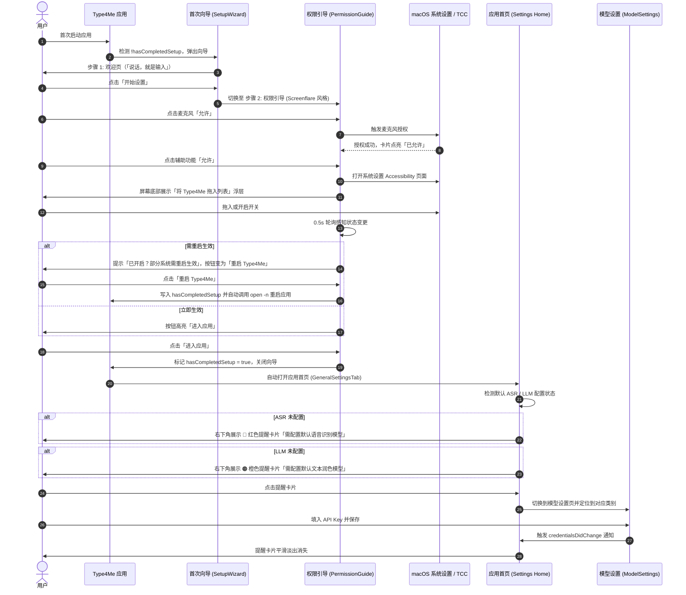

# Type4Me 权限引导与首启流程产品设计

> 文档类型：产品设计  
> 文档状态：当前有效（已实现，持续验证）
> 最后校验：2026-09-05
> 实现基线：`5fce88f`
> 设计日期：2026-09-02  
> 对应分支：`feat/permission-onboarding-redesign`  
> 对应开发设计：[development-design.md](development-design.md)  

---

## 1. 背景与问题定义

### 1.1 现状与痛点
1. **首启向导冗长且脆弱**：现有的 `SetupWizardView` 将欢迎、服务商选择、API Key 输入、权限引导与就绪页面串联在同一个向导中。一旦支持的服务商、认证方式或配置项发生变动，首启向导极易破坏；且在首启阶段强制用户配置繁琐的 API Key 会造成极高的上手流失率。
2. **首启调用链路失效**：`Type4MeApp.swift` 中首启检测调用了未在任何响应链中注册的 `Selector("showSetupWindow:")`，导致首次启动向导无法可靠弹出。
3. **权限引导交互与视觉不够现代直观**：原有的权限引导缺乏强烈的上下文指引、清晰的层级区分（必需 vs 可选）以及系统授权与应用重启的自愈闭环体验。

### 1.2 借鉴设计：Screenflare 权限体验
参考优秀 macOS 录屏工具 Screenflare 的权限请求流程：
- 沉浸式、深色通透的高质感权限卡片；
- 明确的「必需（Required）」与「可选（Optional）」状态徽标；
- 逐项明确的用途解释与即时授权按钮；
- 辅助功能与屏幕录制等需系统设置介入时，提供屏幕底部的拖拽指引浮层；
- 当系统要求重启应用生效时，智能切换主操作按钮为「重启 Type4Me」，提供确定性的自愈闭环。

---

## 2. 产品目标与原则

1. **极简首启（Minimal Onboarding）**：首启仅保留 2 步核心流程（理念认知 → 权限授予），完成即直接进入应用首页。
2. **先体验后配置（Progressive Configuration）**：将复杂的 ASR 与 LLM 模型凭证配置从首次向导中抽离，改为在应用首页右下角以轻量级提醒卡片（Floating Alert Cards）引导，配置完成后自动消失。
3. **权限体验像素级精细化（Screenflare-Grade Permissions）**：
   - 麦克风（必需）：直接系统弹窗或一键直达设置；
   - 辅助功能（必需）：直达设置 + 底部拖拽授权浮层 + 实时状态检测 + 重启自愈引导；
   - Apple 语音识别（可选）：仅在使用 Apple Speech 引擎时呈现，避免对非系统引擎用户产生打扰。
4. **全链路动态双语（Full Dynamic Bilingual Support）**：所有文本遵循 `L(zh, en)` 规范，切换语言即刻刷新，无需重启。

---

## 3. 总体用户旅程 (User Journey)



---

## 4. 详细界面与交互设计

### 4.1 步骤 1：欢迎页（Welcome Step）
- **尺寸**：固定向导尺寸（640 × 480），居中展示，无标准标题栏。
- **元素**：
  - 顶部中心：金色光晕圆环 + 麦克风与波形图标（`waveform.and.mic`）；
  - 主标题：`Type4Me`（24pt Bold）；
  - 副标题：`说话，就是输入` / `Speak, and it types`（次要文本色，居中）；
  - 底部操作：`开始设置` / `Get Started`（大尺寸突出按钮，琥珀金强调色）。

---

### 4.2 步骤 2：Screenflare 风格权限引导（Permissions Step）

#### A. 视觉与排版
- **背景材质**：深色细腻磨砂玻璃（Dark Translucent Material），圆角 20pt，带有微弱边框高光与投影。
- **顶部左侧**：红色彩色窗口控制点。
- **居中头部**：
  - 主标题：`几项系统权限` / `A few permissions`（20pt Semibold，白色）；
  - 隐私说明：`Type4Me 需要以下权限以录制语音并自动打字。录音数据仅在听写期间使用，绝不会离开你的 Mac。` / `macOS asks before Type4Me can record your voice and type for you. Nothing leaves your Mac.`（12pt，二级文本色）。

#### B. 统一权限卡片列表（Grouped Permission Container）
权限置于同一个浅色半透明圆角容器中，行间用极细分割线分隔：

1. **麦克风 (Microphone)**：
   - 图标：红/橙渐变圆角底 + 白色麦克风图标；
   - 标题：`麦克风` / `Microphone`；
   - 徽标：`必需` / `Required`（醒目红底粉字或暖红文字徽标）；
   - 描述：`录制你的语音以进行文字识别。` / `Records your voice for speech-to-text.`；
   - 右侧操作：
     - 未授权：深蓝/品牌色胶囊按钮 `允许` / `Allow`；
     - 已授权：绿色对勾图标 + `已允许` / `Allowed`；
     - 被拒绝：`打开系统设置` / `Open Settings`。

2. **辅助功能 (Accessibility)**：
   - 图标：蓝/紫渐变圆角底 + 白色辅助功能图标；
   - 标题：`辅助功能` / `Accessibility`；
   - 徽标：`必需` / `Required`（醒目红底粉字徽标）；
   - 描述：`监听全局快捷键，并将文字直接输入到目标 App。` / `Listens for hotkeys and types text into your active app.`；
   - 辅助状态提示：若已开启但事件监听尚未激活，显示黄色文字 `已开启？macOS 可能需要在重启应用后生效。` / `Switched it on? macOS applies this on the next launch.`；
   - 右侧操作：
     - 未授权：胶囊按钮 `允许` / `Allow`，点击自动打开系统设置并唤起底部拖拽浮层；
     - 已授权：绿色对勾图标 + `已允许` / `Allowed`。

3. **Apple 语音识别 (Apple Speech Recognition，条件渲染)**：
   - 仅当所选 ASR 引擎为 `Apple Speech`（`.apple`）时呈现；非 Apple Speech 引擎不展现该行，避免冗余权限索取。
   - 图标：青/绿渐变圆角底 + 白色语音识别图标；
   - 标题：`Apple 语音识别` / `Apple Speech Recognition`；
   - 徽标：`可选` / `Optional`（中性灰文字徽标）；
   - 描述：`使用系统内置语音引擎（使用云端或本地模型可跳过）。` / `Transcribes via Apple Speech (can be skipped if using other ASR).`；
   - 右侧操作：胶囊按钮 `允许` / `Allow` / `已允许` / `Allowed`。

#### C. 底部导航与自愈操作栏
- 提示文案：`随时可以在 macOS「系统设置」中更改这些权限。` / `You can change any of these later in System Settings.`（11pt，居中次要文本）。
- 左下角：步骤指示圆点 `• •`。
- 右下角主操作按钮：
  - 状态 1（必需权限未满）：`进入应用` 按钮置灰禁用；
  - 状态 2（辅助功能已开启但需要重启）：高亮蓝色胶囊按钮 **「重启 Type4Me」/「Relaunch Type4Me」**（点击持久化首启完成并自动重启）；
  - 状态 3（必需权限就绪）：高亮琥珀金胶囊按钮 **「进入应用」/「Launch Type4Me」**。

---

### 4.3 应用首页：模型配置引导提醒卡片 (Floating Model Alert Cards)

用户进入主应用窗口（`SettingsTab.general` 首页）后，如果尚未配置默认模型，在**首页右下角**以浮动卡片栈形式提示（仅在 `selectedTab == .general` 首页生效，避免遮挡模型编辑页）：

```text
                                              ┌──────────────────────────────────────┐
                                              │ 🔴 需配置默认语音识别模型            │
                                              │    点击前往模型页配置 API Key 或模型 │
                                              └──────────────────────────────────────┘
                                              ┌──────────────────────────────────────┐
                                              │ 🟠 需配置默认文本润色模型            │
                                              │    用于智能纠错、标点与改写          │
                                              └──────────────────────────────────────┘
```

#### 视觉规范与行为：
1. **ASR 提醒卡片（Red ASR Alert Card）**：
   - 红色强调色微光卡片，带 `waveform.badge.exclamationmark` 图标；
   - 文案：`需配置默认语音识别模型` / `Configure Speech Recognition Model`；
   - 副文案：`点击前往模型页配置 API Key 或本地模型` / `Click to set up API keys or local models`；
   - 点击事件：触发导航至 `SettingsTab.models`，且自动切换子类别 `category = .asr`。
2. **LLM 提醒卡片（Orange LLM Alert Card）**：
   - 琥珀橙强调色微光卡片，带 `sparkles` 图标；
   - 文案：`需配置默认文本润色模型` / `Configure Text Polishing Model`；
   - 副文案：`用于智能纠错、标点与改写` / `Used for smart punctuation and rewriting`；
   - 点击事件：触发导航至 `SettingsTab.models`，且自动切换子类别 `category = .llm`。
3. **消除机制**：
   - 响应 `credentialsDidChange` 通知，一旦对应 Provider 凭证完备（`hasConfiguredCredentials == true`），卡片带有 Apple Spring 弹簧动画平滑缩放淡出消除。

---

## 5. 国际化与文案对照表 (Localization Table)

| 键 / 场景 | 中文 (zh) | 英文 (en) |
|---|---|---|
| 向导标题 | `Type4Me 设置向导` | `Type4Me Setup` |
| 欢迎主标语 | `说话，就是输入` | `Speak, and it types` |
| 欢迎按钮 | `开始设置` | `Get Started` |
| 权限页面标题 | `几项系统权限` | `A few permissions` |
| 权限页面副标题 | `Type4Me 需要以下权限以录制语音并自动打字。录音数据仅在听写期间使用，绝不会离开你的 Mac。` | `macOS asks before Type4Me can record your voice and type for you. Nothing leaves your Mac.` |
| 必需标签 | `必需` | `Required` |
| 可选标签 | `可选` | `Optional` |
| 麦克风名称 | `麦克风` | `Microphone` |
| 麦克风描述 | `录制你的语音以进行文字识别。` | `Records your voice for speech-to-text.` |
| 辅助功能名称 | `辅助功能` | `Accessibility` |
| 辅助功能描述 | `监听全局快捷键，并将文字直接输入到目标 App。` | `Listens for hotkeys and types text into your active app.` |
| 重启提示 | `已开启？macOS 可能需要在重启应用后生效。` | `Switched it on? macOS applies this on the next launch.` |
| 语音识别名称 | `Apple 语音识别` | `Apple Speech Recognition` |
| 语音识别描述 | `使用系统内置语音引擎（使用云端或本地模型可跳过）。` | `Transcribes via Apple Speech (can be skipped if using other ASR).` |
| 操作: 允许 | `允许` | `Allow` |
| 操作: 已允许 | `已允许` | `Allowed` |
| 操作: 重启 | `重启 Type4Me` | `Relaunch Type4Me` |
| 操作: 进入应用 | `进入应用` | `Launch Type4Me` |
| 底部提示 | `随时可以在 macOS「系统设置」中更改这些权限。` | `You can change any of these later in System Settings.` |
| 首页 ASR 提醒标题 | `需配置默认语音识别模型` | `Configure Speech Recognition Model` |
| 首页 ASR 提醒描述 | `点击前往模型页配置 API Key 或本地模型` | `Click to set up API keys or local models` |
| 首页 LLM 提醒标题 | `需配置默认文本润色模型` | `Configure Text Polishing Model` |
| 首页 LLM 提醒描述 | `用于智能纠错、标点与改写` | `Used for smart punctuation and rewriting` |
