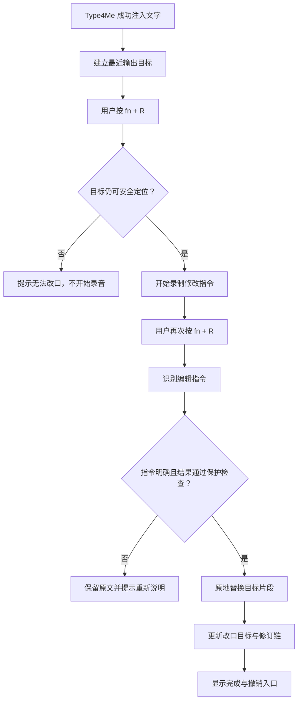

# Type4Me 改口（Revise）产品功能设计

> 文档类型：产品设计
> 文档状态：当前有效（已实现，持续验证）
> 适用平台：Type4Me macOS
> 文档范围：最近一次文字输出的语音修改、目标定位、交互状态、安全边界、历史与隐私
> 设计日期：2026-08-18
> 最后校验：2026-09-24
> 实现基线：`d57ce17`（PR #322）
> 上游文档：`docs/features/intelli-sense/product-design.md`、`docs/features/intelli-sense/user-correction-text-recognition-design.md`
> 下游文档：`docs/features/revise/development-design.md`；专项评测设计由该文档第 23 节定义

---

## 1. 执行摘要

Type4Me 新增全局快捷能力：

- 中文显示名称：**改口**；
- 英文显示名称：**Revise**；
- 默认快捷键：**`fn + R`**；
- 产品形态：**全局快捷动作，不是处理模式**。

改口允许用户在 Type4Me 完成一次文字输入后，通过一句自然语言指令修改最近一次仍可安全定位的输出，例如：

- “把最后一句删掉。”
- “第二段口语一点。”
- “把三点改成四点，其他别动。”
- “不是杰瑞，是 Jerry。”
- “改成编号列表。”
- “撤销刚才的改口。”

一句话定义：

> 改口通过语音指令，对最近一次仍可安全定位的 Type4Me 文字输出进行原地修改。

核心体验是“先说，再改口”：第一次口述负责形成文字，第二次口述负责说明怎样修改。系统不要求用户重新选择文字，不把编辑指令输入目标 App，也不把改口变成新的常驻模式。

第一版只修改最近一次 Type4Me 成功注入的文字。目标无法唯一定位、已经发送、位于敏感输入框、发生无法解释的结构变化或指令存在关键歧义时，系统不猜测、不修改。

---

## 2. 术语与命名边界

### 2.1 产品名称

对外统一使用：

| 语言 | 名称 | 辅助说明 |
|---|---|---|
| 中文 | 改口 | 用语音修改上一轮输出 |
| 英文 | Revise | Revise your last output by voice |

设置项、快捷键说明、通知和帮助文档均使用“改口”。不使用“修复模式”“纠错模式”“二次润色”等名称。

### 2.2 与口述内自我修正区分

“改口”在 Type4Me 中已有一层自然语言含义：用户可能在同一次口述里说“明天下午三点，不对，改成四点”。这属于**口述内自我修正**，由语音润色或 Intelli Sense 在首次输出时处理。

本功能是**输出后改口**：上一轮文字已经注入，用户通过新的快捷动作发出编辑指令。

产品文案可以统一使用“改口”，但开发设计、数据结构和埋点必须区分：

- `spokenSelfCorrection`：同一次口述内推翻旧表达；
- `reviseAction`：对已经注入的上一轮输出进行修改。

两者不得共用同一个状态枚举、历史事件或 Guard 结论。

### 2.3 “上一轮输出”的定义

“上一轮输出”不是剪贴板内容、当前选区、输入框全文或最近一条历史记录。它特指：

> Type4Me 最近一次确认成功注入外部文本控件，并且当前仍能唯一定位到的文字片段。

失败、取消、只复制未注入、Ask Anything 回答、Mac 操作结果和没有产生文字的任务都不会成为改口目标。

---

## 3. 背景与用户问题

### 3.1 当前输入链路只解决第一次生成

Type4Me 已经可以通过快速模式、Intelli Sense、翻译和语音润色等方式生成文字，但输出一旦注入，用户通常只能：

- 用键盘手动定位并修改；
- 删除整段后重新口述；
- 复制文字到其他 AI 工具中改写；
- 接受不完全满意的版本。

对语音优先用户来说，这会在“口述已经很快”和“修改仍然依赖键鼠”之间形成明显断点。

### 3.2 重新口述的成本过高

多数不满意并不意味着整段都错了。常见需求只是：

- 改一个事实、数字、人名或术语；
- 删除一句多余内容；
- 补上一点遗漏信息；
- 调整语气、长短或结构；
- 撤销模型一次不合适的整理。

要求用户完整重说，会丢失已经正确的部分，也会再次引入 ASR 和模型不确定性。

### 3.3 手动修改闭环不等于主动编辑能力

Intelli Sense 已经能够在限定条件下观察用户对输出的手动修改，用于纠错建议和表达习惯学习。但该能力是后台观察，不帮助用户完成眼前这次修改。

改口填补的是主动编辑闭环：

```text
说出内容 → 获得文字 → 发现不满意 → 说出修改要求 → 原地得到新版本
```

---

## 4. 产品定位

### 4.1 一个全局动作，不是单独模式

Type4Me 的处理模式回答：

> 这一次口述应该怎样变成文字？

改口回答：

> 最近一次已经产生的文字应该怎样修改？

因此改口具有以下产品属性：

- 不出现在模式列表中；
- 不成为当前选中模式；
- 不改变用户下一次普通录音使用的模式；
- 通过独立全局快捷键调用；
- 可以作用于任何符合资格的文字输出模式；
- 只在存在有效目标时可用。

### 4.2 与模式的关系

| 来源 | 能否成为改口目标 | 说明 |
|---|---:|---|
| 快速模式 | 是 | 可修改原始转写结果 |
| Intelli Sense | 是 | 修改实际注入的最终结果 |
| 翻译模式 | 是 | 默认保持译文目标语言 |
| 语音润色 | 是 | 修改润色后的实际结果 |
| 用户自定义文字模式 | 是 | 只要最终成功注入文字 |
| Prompt 优化 | 视实际行为 | 成功注入文字时可以 |
| 代办模式 | 视实际行为 | 仅文字注入结果可以 |
| Ask Anything | 否 | 回答存在于专用面板，不属于外部注入片段 |
| Mac 操作 | 否 | 外部动作不能通过改口回滚或修改 |
| 取消输入或只复制 | 否 | 没有可靠的外部目标 |

改口完成后，当前模式、模式顺序和模式快捷键均保持不变。

### 4.3 产品承诺

改口只承诺修改 Type4Me 自己最近一次注入、并且现在仍能安全找到的文字。它不是任意选区编辑器、全文 AI 编辑器或外部 App 自动化工具。

---

## 5. 产品目标与非目标

### 5.1 产品目标

1. 让用户无需键盘和鼠标即可修改上一轮输出；
2. 让局部修改保留已经正确的内容，避免整段重新口述；
3. 对明确指令直接原地生效，不增加固定确认步骤；
4. 在用户已经手动修改后，以当前可靠版本为基础继续编辑；
5. 支持连续多轮改口和安全撤销最近一次改口；
6. 对目标、范围或指令有歧义的情况安全失败；
7. 不改变现有模式的 Prompt、默认选择和快捷键语义；
8. 以最少必要文本完成任务，不读取整篇文档或无关上下文；
9. 为未来的词汇纠错证据与表达习惯学习保留清晰数据边界；
10. 建立可独立衡量的成功率、撤销率和误修改率。

### 5.2 明确非目标

第一版不负责：

- 修改任意更早的历史输出；
- 通过用户当前选区临时指定任意文本；
- 修改已经发送的聊天消息或邮件；
- 跨 App、跨窗口或跨输入控件寻找上一轮内容；
- 自动切回原 App、重新聚焦控件或滚动定位内容；
- 读取整个文档、整个输入框或剪贴板作为补充上下文；
- 回答问题、解释内容或与用户进行多轮对话；
- 点击发送、提交表单、打开应用或执行其他外部动作；
- 修改文件、日历、任务或远端数据；
- 从一次改口直接形成永久词汇映射或表达偏好；
- 同时维护多个可改口目标；
- 提供复杂版本树、分支版本或历史版本合并；
- 在目标有歧义时弹出候选列表要求用户选择。

---

## 6. 核心产品原则

### 6.1 用户明确触发

改口只能由独立快捷键或明确的产品入口触发。普通口述中的“帮我改一下”“换个说法”等内容仍按当前模式处理，不自动切换为改口。

### 6.2 只碰自己的上一轮输出

系统不得因为光标附近存在相同文字，就修改并非由 Type4Me 最近一次注入的内容。

### 6.3 当前版本优先

如果用户在上一轮输出后已经手动修改了一部分，改口必须编辑当前能够可靠解析出的版本，不能用历史中的旧版本覆盖用户手改内容。

### 6.4 最小必要修改

明确的局部指令只允许引起局部变化。“把三点改成四点，其他别动”中的“其他别动”是强约束。

“更简洁”“更口语”“改成列表”等全局表达指令可以改变整个目标片段，但仍不得引入无依据事实。

### 6.5 不猜目标，不猜关键意图

系统无法唯一确定修改对象、引用范围或替换位置时，不尝试选择“最可能”的一个。用户重新说一句更明确的指令，成本低于错误修改现有内容。

### 6.6 快速生效，可安全撤销

高置信度结果直接原地替换，不为每次修改增加预览确认。速度由自动应用保证，安全感由明确状态、修改后反馈和撤销能力保证。

### 6.7 不把编辑变成执行

即使指令是“把这条发给 Jerry”，改口也只能按文本编辑契约处理，不点击发送、不查找联系人、不声称动作已经完成。

### 6.8 隐私优先于可用性

密码框、密钥输入区、系统标记的安全文本控件和明确命中的敏感目标不可改口。无法证明目标范围安全时，不把输入框全文发送给模型。

---

## 7. 信息架构与设置

### 7.1 设置位置

改口不进入“模式”页面。它位于全局快捷能力区域：

```text
设置
└── 快捷键 / 全局操作
    └── 改口上一轮
        ├── 启用改口
        ├── 快捷键：fn + R
        └── 说明：用语音修改最近一次 Type4Me 输出
```

如果当前产品尚无“全局操作”分组，第一版可以放入现有快捷键设置，并通过独立卡片与模式快捷键分开。

### 7.2 默认状态

- 新安装默认启用；
- 默认快捷键为 `fn + R`；
- 老用户升级时可以注册 `fn + R`，但必须先检测是否与现有用户快捷键冲突；
- 已被用户占用时不静默覆盖，显示“未设置”并允许用户自行配置；
- 关闭功能后不监听改口快捷键，并立即清除内存中的可改口目标；
- 不提供时间窗口、模型温度、修改强度等高级设置。

### 7.3 App 排除

改口属于用户明确触发的全局能力，不直接继承 Intelli Sense 的感知黑名单。第一版提供独立的“改口不可用 App”列表，并遵循：

- 默认沿用 Type4Me 已有的系统级敏感控件判断；
- 用户可按 App 禁用改口；
- 被禁用 App 中不建立目标、不读取文字、不保存改口记录；
- App 排除只影响改口，不影响该 App 中的普通 Type4Me 输入。

后续如将多个功能的排除列表统一为全局隐私设置，需要单独迁移设计，不能静默改变 Intelli Sense 现有黑名单语义。

---

## 8. 可改口目标

### 8.1 建立条件

一次输出只有满足以下条件，才建立新的改口目标：

- 由 Type4Me 发起；
- 最终结果为文字；
- 文字实际成功注入外部控件；
- 注入范围和目标控件可追踪；
- 目标不是敏感控件；
- 当前 App 未被用户排除；
- 注入内容非空；
- 注入结果没有处于不确定或部分失败状态。

建立目标时只保留支持后续定位所需的最小信息，包括注入文本、控件身份、注入范围、局部锚点、App 身份、时间和来源记录 ID。具体字段由开发设计确定。

### 8.2 唯一目标规则

任意时刻最多只有一个可改口目标。

以下事件会用新目标取代旧目标：

- 任意模式完成下一次成功文字注入；
- 用户通过其他 Type4Me 入口成功向另一控件注入文字。

以下事件不会取代旧目标：

- 普通录音失败；
- 用户取消输入；
- LLM 请求失败且没有注入；
- 只复制结果但没有注入；
- 打开设置或历史页面。

### 8.3 有效期

第一版采用双重失效规则：

- 新的成功文字注入立即取代旧目标；
- 没有新输出时，目标在建立 **10 分钟**后失效。

10 分钟是 Beta 产品阈值，不向用户暴露为可配置项。它用于减少长期持有外部控件和文本锚点造成的隐私与误定位风险。Beta 期间根据真实使用的触发时间分布复核该阈值。

### 8.4 激活时重新验证

快捷键按下时必须重新确认：

- 原 App 当前处于前台；
- 当前焦点仍位于原输入控件，或可确定是同一可编辑控件；
- 上一轮文字仍然存在；
- 目标片段能够唯一解析；
- 当前版本没有跨越目标边界的冲突修改；
- 控件没有变为只读、密码或敏感状态；
- 内容没有已经发送、清空或被替换为 placeholder。

系统不自动切换 App 或焦点。用户离开原输入位置后按下改口，只显示不可用提示。

### 8.5 当前版本解析

每次改口都涉及三份文字：

```text
original_output      上一轮最初注入的版本
current_revision     当前输入框中可靠解析出的目标版本
revise_instruction   本次语音识别出的编辑指令
```

模型编辑 `current_revision`，而不是直接编辑 `original_output`。

示例：

```text
最初输出：明天下午三点和杰瑞开会。
用户手改：明天下午三点和 Jerry 开会。
改口指令：改成四点，其他别动。
最终结果：明天下午四点和 Jerry 开会。
```

如果当前版本只能通过读取或保存整个输入框才能推测，解析必须失败，不得扩大目标范围。

---

## 9. 核心交互流程

### 9.1 正常流程



### 9.2 开始改口

用户按下 `fn + R` 后：

1. Type4Me 先验证目标；
2. 验证成功才开始录音；
3. 浮动条进入与普通录音明显不同的改口状态；
4. 用户口述的是修改指令，不是要插入的新文字；
5. 指令识别结果不会直接写入目标 App。

推荐状态文案：

> 说说你想怎么改

### 9.3 结束改口

- 再次按 `fn + R`：结束录音并处理；
- 按 ESC：取消本次改口，不应用修改，不保存未完成指令；
- 点击浮动条停止按钮：等同再次按 `fn + R`；
- 点击取消：等同 ESC。

改口中的 ESC 属于“取消编辑任务”，与标准输入中“取消注入但继续保留识别与历史”的既有语义不同。界面必须明确显示“取消改口”，避免用户误解。

### 9.4 处理与替换

处理期间显示：

> 正在改口…

处理完成前不修改原文。结果通过验证后，一次性替换目标片段，避免用户看到逐步删除和粘贴的中间态。

替换成功后：

- 光标默认位于新版本末尾；
- 不自动发送或提交；
- 不改变当前 Type4Me 模式；
- 新版本成为后续连续改口的目标；
- 显示轻量成功反馈和“撤销”入口。

### 9.5 连续改口

用户可以对同一目标连续改口：

```text
初始输出 O0 → 第一次改口 R1 → 第二次改口 R2
```

每次都基于输入框中的当前可靠版本，而不是基于历史中的 O0 重算。用户在两次改口之间的手动修改也必须被保留。

只要发生新的普通文字注入，当前修订链结束，新输出成为唯一目标。

### 9.6 撤销改口

第一版提供两种撤销入口：

- 成功反馈中的“撤销”；
- 再次按 `fn + R` 后说“撤销刚才的改口”。

撤销是本地确定性操作，不调用 LLM。执行前仍需确认当前目标恰好等于最近一次改口结果，或能无歧义解析为该结果。用户已经继续手动编辑时，不直接覆盖，提示：

> 内容已继续修改，无法安全撤销。

第一版只保证撤销最近一次改口，不提供重做和任意历史版本选择。

### 9.7 与其他录音任务冲突

| 当前状态 | 按 `fn + R` |
|---|---|
| 空闲且目标有效 | 开始改口录音 |
| 空闲但目标无效 | 提示不可用，不开始录音 |
| 正在改口录音 | 结束录音并处理 |
| 正在普通录音 | 不跨任务切换，提示先完成当前输入 |
| 正在处理或注入普通结果 | 等待当前任务结束；本次按键不排队 |
| 正在处理改口 | 忽略重复触发并保持处理状态 |
| Ask Anything 正在录音或生成 | 提示当前任务进行中 |
| Mac 操作正在执行 | 提示当前任务进行中 |

改口不复用“跨模式按键结束并切换处理模式”的语义，因为它不是模式。任何任务之间都不建立隐式排队。

---

## 10. 支持的编辑意图

### 10.1 精确替换

示例：

- “把三点改成四点。”
- “Jerry 拼成 J-E-R-R-Y。”
- “不是预发布，是生产环境。”
- “把第二个 Type4Me 改成 Type4Me Pro。”

规则：

- 原目标必须唯一；
- 多处相同文本而指令没有限定位置时不猜；
- 替换以用户明确提供的新事实或新文字为准；
- “其他别动”“只改……”属于强范围约束。

### 10.2 删除

示例：

- “删掉最后一句。”
- “第二点不要了。”
- “去掉开头的客套话。”

规则：

- 结构或句子边界必须可确定；
- “客套话”等语义范围可以由模型判断，但不得顺带删除事实内容；
- 删除后为空时允许完成，但需要显示“上一轮输出已删除”并立即结束目标。

### 10.3 增补

示例：

- “最后加一句，周五之前给我回复。”
- “第二点补上需要产品确认。”
- “开头加一个谢谢。”

规则：

- 只补充用户在指令中明确给出的内容；
- 不替用户生成没有说出的理由、细节、承诺或数据；
- 插入位置不明确且会明显影响含义时拒绝执行。

### 10.4 表达调整

示例：

- “更简洁一点。”
- “说得自然一点，别那么像邮件。”
- “正式一点，但不要加称呼和落款。”
- “语气别那么强硬。”

规则：

- 可以修改整个目标片段；
- 必须保留事实、立场、语言方向和关键限定；
- 不因“更正式”自动添加称呼、主题、落款或承诺；
- 不因“更简洁”删除决定结论的条件。

### 10.5 结构与格式

示例：

- “改成三点编号列表。”
- “不要列表，合成一段。”
- “每一点单独一行。”
- “保留内容，只调整标点。”

规则：

- 格式变化可以覆盖整个目标；
- 列表序号属于结构标记，不得被误判为新增事实数字；
- 搜索框、单行控件或不支持换行的目标不能应用多行格式；
- 富文本样式不在第一版保证范围内，只保证纯文字结构。

### 10.6 语言调整

示例：

- “翻成英文，专有名词不要动。”
- “把第一句改成中文。”
- “英文部分更自然一点。”

规则：

- 默认保持当前目标的句架语言；
- 只有用户明确要求时才改变整体语言；
- 来自翻译模式的目标默认保持该译文语言；
- 混合语言中的代码、路径、产品名和专有词默认保持字面形式。

### 10.7 撤销

以下表达识别为撤销最近一次改口：

- “撤销刚才的改口。”
- “恢复上一版。”
- “刚才那次不要了。”

如果当前没有成功改口记录，提示“没有可撤销的改口”，不得解释或生成文字。

### 10.8 暂不支持或必须拒绝的意图

| 指令 | 处理 |
|---|---|
| “把上上次那段改一下” | 拒绝：第一版只有最近目标 |
| “改一下我选中的文字” | 拒绝：第一版不处理任意选区 |
| “帮我看看写得怎么样” | 拒绝或提示改成明确编辑要求，不回答评价 |
| “查一下正确日期再改” | 拒绝：不搜索、不补充外部事实 |
| “改好后直接发送” | 可以修改，但绝不发送；完成后提示未发送 |
| “把邮件里其他几段也统一一下” | 拒绝：不读取目标外全文 |
| “恢复三次之前的版本” | 拒绝：第一版只撤销最近一次 |

---

## 11. 指令理解与修改契约

### 11.1 输入

改口处理只使用：

- 当前可靠目标文本；
- 本次 ASR 识别出的编辑指令；
- 目标控件的有限结构属性，例如单行/多行；
- 当前目标的语言和来源模式；
- 本次修订必要的保护信息。

第一版不提供：

- 输入框其他正文；
- 光标附近无关段落；
- 选中文本；
- 剪贴板；
- 完整窗口或文档内容；
- Intelli Sense 表达档案；
- Ask Anything 对话历史。

### 11.2 输出

模型返回结构化结果，产品语义至少包含：

- 修改后的完整目标文本；
- 识别出的编辑类型；
- 指令约束摘要；
- 是否存在目标或意图歧义；
- 是否声称执行外部动作。

模型不负责生成键盘事件、Accessibility 下标或目标 App 操作步骤。实际 diff、范围确认和替换由本地确定性逻辑完成。

### 11.3 修改范围

编辑范围分为：

- **局部范围**：精确替换、指定句子、指定段落、指定列表项；
- **整体范围**：更简洁、更正式、改成列表、翻译整段；
- **不明确范围**：目标中存在多个同等候选且指令无法消歧。

局部范围结果如果改动明显越过目标区域，必须拒绝。整体范围允许广泛措辞和结构变化，但仍受事实与安全保护。

### 11.4 指令优先级

约束按以下优先级处理：

1. 安全、隐私和“不执行外部动作”；
2. 用户明确指定的新事实、新文字和删除要求；
3. 用户明确指定的范围限制，例如“只改”“其他别动”；
4. 用户指定的语言、语气和格式；
5. 默认的事实、语言和结构保真；
6. 一般可读性优化。

模型不得用“保持原文事实”否决用户在改口指令中明确要求的新事实。需要保护的是**指令确认后的最终事实**，不是上一版本中已经被用户明确推翻的事实。

---

## 12. 结果保护与自动应用

### 12.1 自动应用条件

结果只有同时满足以下条件才自动替换：

- 目标在处理完成时仍可唯一定位；
- 当前版本与请求开始时的冻结版本一致；
- 指令具有足够明确的编辑意图；
- 输出非工具调用、解释、回答或操作声明；
- 修改范围与指令一致；
- 未改变指令未授权的关键事实；
- 未发生非预期整段换语言；
- 输出适合目标控件结构；
- 未命中敏感信息与极端扩写规则。

### 12.2 必须保护的内容

除非指令明确修改，默认保护：

- 数字、日期、时间、金额和百分比；
- 人名、组织名、产品名和技术标识符；
- URL、邮箱和字面路径；
- 强否定、禁止、必须、可能等语义强度；
- 观点归属和说话人；
- 条件、例外与范围限定；
- 目标的主语言；
- 代码、命令、参数和占位符。

### 12.3 允许被明确推翻的内容

如果指令明确要求修改，下列变化合法：

- “三点改成四点”允许删除 3、加入 4；
- “不是测试环境，是生产环境”允许替换环境事实；
- “删掉最后一句”允许删除该句中的受保护 token；
- “翻成英文”允许整体语言变化；
- “把列表合成一段”允许删除结构序号。

Guard 必须以编辑指令解析出的授权变化为前提，不能机械要求新结果包含旧版本全部 token。

### 12.4 处理期间的并发变化

从开始处理到准备替换之间，如果用户或外部 App 又修改了目标：

- 不覆盖新变化；
- 不用旧请求结果做近似合并；
- 放弃本次自动应用；
- 提示“内容在处理期间发生了变化，请再说一次”。

第一版不做 LLM 结果与实时编辑的自动三方合并。下一次改口会重新读取最新可靠版本。

### 12.5 不设置固定确认弹窗

第一版不为高风险结果提供 diff 确认弹窗。结果要么满足自动应用标准，要么不修改。原因是：

- 固定确认会破坏语音修改的速度优势；
- 低置信度结果不应把判断责任转嫁给用户；
- 撤销适合处理“结果合法但用户不喜欢”的情况；
- 拒绝适合处理“目标或安全性不确定”的情况。

Beta 如发现大量合法结果因歧义被拒绝，再单独评估可选预览，不在第一版预埋复杂分支。

---

## 13. 失败与降级

### 13.1 失败原则

任何失败都保留当前外部文字，不注入编辑指令，不自动回退为普通输入。

### 13.2 失败场景

| 场景 | 用户反馈 | 外部文字 |
|---|---|---|
| 没有可改口目标 | 还没有可修改的上一轮输出 | 不变 |
| 目标超过 10 分钟 | 上一轮输出已过期 | 不变 |
| 已切换 App 或控件 | 请回到上一轮输入的位置 | 不变 |
| 内容已发送或清空 | 上一轮内容已经离开输入区域 | 不变 |
| 目标定位有歧义 | 无法安全定位上一轮内容 | 不变 |
| 敏感或密码输入框 | 此处不支持改口 | 不变 |
| App 被用户排除 | 此 App 已关闭改口 | 不变 |
| 没有识别到指令 | 没听清想怎么改，请重试 | 不变 |
| 指令不是编辑要求 | 请直接说要修改什么 | 不变 |
| 引用对象不明确 | 没有修改：请说清要改哪一处 | 不变 |
| 模型失败或超时 | 改口失败，请重试 | 不变 |
| 结果未通过保护检查 | 为避免改错，已保留原文 | 不变 |
| 处理期间内容变化 | 内容发生了变化，请再说一次 | 保留最新内容 |
| 替换失败 | 未能应用修改，原文已保留 | 尽力恢复原状 |

### 13.3 不允许的降级

失败时不得：

- 把编辑指令粘贴进输入框；
- 将当前选区当作替代目标；
- 修改输入框中第一处相同字符串；
- 自动切回上一 App；
- 用历史文本覆盖当前文本；
- 回退到修改整个输入框；
- 将待修改内容复制到剪贴板并声称完成；
- 因 LLM 失败而使用未经处理的 ASR 指令替换原文。

---

## 14. 状态与反馈

### 14.1 状态模型

用户可感知状态包括：

| 状态 | 说明 | 推荐文案 |
|---|---|---|
| 不可用 | 没有有效目标 | 还没有可修改的上一轮输出 |
| 录音 | 正在采集编辑指令 | 说说你想怎么改 |
| 识别 | 正在完成 ASR | 正在听取修改… |
| 处理 | 正在生成并验证新版本 | 正在改口… |
| 应用 | 正在原地替换 | 正在应用修改… |
| 完成 | 修改成功 | 已改好 |
| 已撤销 | 最近修改恢复 | 已恢复上一版 |
| 失败 | 未修改外部文字 | 为避免改错，已保留原文 |

### 14.2 视觉区别

改口复用现有录音浮动条的尺寸、位置和基础组件，但必须通过图标、强调色或状态词与普通录音区分。不能只依靠颜色表达状态。

建议使用“回转箭头 + 声波”图标，并始终显示“改口”或“说说你想怎么改”。

### 14.3 成功反馈

成功反馈保持轻量，建议显示 2–4 秒：

```text
已改好                         撤销
```

不默认展示完整 diff，不播放长提示音，不抢走目标 App 焦点。用户需要追溯时进入历史记录。

### 14.4 声音反馈

- 开始录音：使用与普通录音可区分但同一品牌体系的短提示音；
- 完成修改：使用轻量成功音；
- 无法执行：使用低干扰失败音，并同时显示文字原因；
- 声音遵循 Type4Me 现有提示音总开关。

---

## 15. 快捷键设计

### 15.1 默认快捷键

默认使用：

> `fn + R`

理由：

- `R` 对应 Revise，具有稳定记忆点；
- 与快速模式 `fn`、Intelli Sense `fn + 左 Control`、翻译 `fn + 左 Shift`、随便问 `fn + Space` 不冲突；
- 不占用 `⌥ + 数字` 的模式直选体系；
- 单手可触达；
- 明确表达这是独立动作而不是模式编号。

### 15.2 交互语义

与现有默认快捷键保持切换式：

- 第一次按下：开始改口录音；
- 第二次按下：结束并处理；
- ESC：取消本次改口。

第一版不采用双击 `fn` 或长按 `fn`：

- 双击可能与 macOS 听写和普通录音误触冲突；
- 长按会迫使普通 `fn` 录音延迟判断或改变既有肌肉记忆；
- 两种手势都难以在快捷键设置中清晰表达和录制。

### 15.3 自定义与冲突

- 用户可以修改或清除快捷键；
- 录制时沿用现有全局快捷键冲突检测；
- 不允许与任一模式快捷键或其他全局动作完全相同；
- 升级用户已有 `fn + R` 绑定时不覆盖；
- 菜单栏和设置页显示当前有效绑定。

---

## 16. 历史、修订链与可追溯性

### 16.1 历史归属

改口不是一条新的普通识别历史，而是上一轮文字输出的修订事件。历史页面应将改口展示在原记录下，而不是把编辑指令混入主历史列表。

示例：

```text
Type4Me 输出
明天下午三点和 Jerry 开会。

改口 1
指令：改成四点，其他别动。
结果：明天下午四点和 Jerry 开会。
```

### 16.2 修订链

同一目标的连续改口形成线性修订链：

```text
O0 → R1 → R2
```

第一版不在 UI 中提供版本树或任意版本恢复。历史展示可以折叠连续修订，只用于回溯，不提供重新应用按钮。

### 16.3 记录条件

- 仅在现有识别历史功能开启时保存成功改口；
- 未识别、取消、目标无效等失败不创建用户可见历史项；
- 如果原输出没有历史记录，改口仍可在内存中完成，但不创建孤立修订记录；
- 历史关闭后，目标定位所需内容只在内存中短暂存在；
- 删除原识别历史时，关联改口记录一并删除；
- 清空全部历史时，改口修订与当前内存目标一并清除。

### 16.4 保存内容

成功改口可以保存：

- 原历史记录 ID；
- ASR 识别后的编辑指令；
- 修改前目标版本；
- 修改后目标版本；
- 编辑类型；
- 时间；
- 来源模式；
- 应用或撤销状态；
- 版本化的脱敏验证结论。

不得保存：

- 输入框目标之外的全文；
- Accessibility 对象标识或可恢复的外部控件引用；
- Prompt 正文；
- 未发送给模型的周边上下文；
- 密码、验证码、密钥等敏感信息；
- 模型隐藏推理。

---

## 17. 隐私与安全

### 17.1 最小文本原则

模型只接收当前可改口目标和编辑指令。为了定位目标而保留的左右锚点只用于本地解析，不发送给模型。

### 17.2 敏感控件

以下情况不建立目标，也不允许激活改口：

- `NSSecureTextField` 或 Accessibility 标记的密码控件；
- 系统凭据、验证码和密钥输入区域；
- Type4Me 既有敏感控件规则命中；
- 无法判断是否为安全文本输入的高风险控件。

调试日志只记录枚举原因和长度，不记录目标文本、编辑指令或锚点正文。

### 17.3 用户主动修改不等于长期授权

用户触发一次改口，只授权本次目标编辑。它不自动授权：

- 持续观察整个文档；
- 将修改结果形成永久偏好；
- 将词汇映射写入全局词库；
- 在其他 App 中读取类似内容；
- 对未来输出执行同类修改。

### 17.4 网络处理

改口沿用 Type4Me 当前配置的 ASR 和 LLM 提供商。设置说明应明确：目标文本和编辑指令可能根据用户的提供商配置发送到对应服务。

如果没有可用 LLM，第一版不提供规则引擎降级编辑，只提示“需要先配置可用的语言模型”。确定性的“撤销最近改口”不依赖 LLM。

---

## 18. 与纠错学习和表达习惯的关系

### 18.1 第一版不自动学习

改口可能包含不同性质的变化：

| 指令 | 性质 |
|---|---|
| “杰瑞改成 Jerry” | 可能是稳定词汇纠正 |
| “三点改成四点” | 本次事实变更 |
| “口语一点” | 本次表达要求 |
| “删掉最后一句” | 本次内容编辑 |

因此第一版所有改口都不直接写入：

- `HotwordStorage`；
- `SnippetStorage`；
- Intelli Sense 表达档案；
- App 场景偏好。

### 18.2 与注入后观察的去重

改口由 Type4Me 主动应用，不能被 Intelli Sense 的用户修改观察器误认为用户手工纠错或表达习惯证据。

改口开始、替换和撤销期间，应暂停或标记对应观察 session，避免形成自我学习闭环。

用户在改口完成后继续手动修改，仍可按现有规则作为新的真实用户编辑证据，但必须以改口后的版本作为观察基线。

### 18.3 后续学习方向

未来可以将明确的“把 X 改成 Y”作为高质量词汇纠错证据，但仍需：

- 排除数字、日期、金额和一次性事实；
- 通过中英文稳定 token 边界；
- 请求用户确认；
- 确认后才进入全局热词与片段替换；
- 与现有纠错候选合并去重。

表达调整可以作为风格证据的显式来源，但需要独立产品设计，第一版不启用。

---

## 19. 边界场景

### 19.1 用户手动编辑后再改口

只要当前版本可以安全解析，基于用户手改后的版本继续编辑。不能因为与最初输出不同就直接覆盖或失效。

### 19.2 用户已经发送消息

发送、提交、控件清空或 placeholder 出现后，目标失效。改口不尝试调用 App 的“编辑已发送消息”能力。

### 19.3 输入框中出现多份相同文本

优先使用注入范围、控件身份和局部锚点定位。仍存在多个同等候选时失败，不选第一处或离光标最近的一处。

### 19.4 富文本和 Markdown

第一版保证文字内容，不保证字体、颜色、链接、评论、修订标记或富文本 span 的完整保留。检测到替换会破坏不可恢复的富文本结构时，功能不可用。

Markdown 作为纯文本处理，围栏代码块、链接、表格和列表标记作为受保护结构。

### 19.5 单行控件

单行控件可以进行替换、删除、缩短和语气调整，但拒绝会产生换行、列表或多段落的结果。

### 19.6 代码、终端与路径

代码、命令、参数、路径和标识符采用严格字面保护。只有用户明确给出替换前后内容时才修改。第一版不根据自然语言要求大范围重构代码或命令。

### 19.7 协作编辑器

处理期间任何来自用户、输入法、同步或协作者的目标变化都会阻止自动应用。第一版不区分变化来源。

### 19.8 输入法组合态

目标处于 marked text 或输入法组合状态时不开始替换。等待组合结束后，用户可以重新触发改口。

---

## 20. 成功指标

### 20.1 北极星指标

> 改口成功后无需键盘继续修改的比例。

它衡量用户是否真正通过语音完成了二次编辑，而不是模型是否返回了某段文字。

### 20.2 核心指标

| 指标 | 定义 | 目标方向 |
|---|---|---|
| 改口触发率 | 有效输出后触发改口的 session 占比 | 用于判断需求强度，不追求越高越好 |
| 目标可用率 | 触发时能安全解析目标的比例 | 越高越好 |
| 指令完成率 | 开始录音后成功应用结果的比例 | 越高越好 |
| 一次成功率 | 一次改口后没有重试、撤销或立即手改 | 越高越好 |
| 撤销率 | 成功改口后被撤销的比例 | 越低越好 |
| 连续重试率 | 同一目标 30 秒内因失败再次改口 | 越低越好 |
| 外部误修改率 | 修改了错误范围、错误控件或非目标文字 | 必须接近 0 |
| 未授权事实变化率 | 结果改变了指令未授权的关键事实 | 必须接近 0 |
| P50/P95 延迟 | 停止录音到完成替换的时间 | 持续降低 |

### 20.3 失败原因指标

只记录无正文枚举和耗时：

- `noTarget`；
- `expired`；
- `appChanged`；
- `controlChanged`；
- `targetMissing`；
- `targetAmbiguous`；
- `sensitive`；
- `instructionEmpty`；
- `instructionAmbiguous`；
- `validationRejected`；
- `targetChangedDuringProcessing`；
- `replacementFailed`；
- `providerFailure`。

不得在遥测中上传目标文本、编辑指令、模型结果或锚点。

---

## 21. MVP 范围与阶段规划

### 21.1 阶段 A：安全目标与基础闭环

包含：

- 建立唯一最近输出目标；
- `fn + R` 全局快捷键；
- 同 App、同控件、10 分钟有效期；
- 指令录音、ASR 和 LLM 编辑；
- 精确替换、删除、增补、表达和格式调整；
- 结果保护与原地替换；
- 连续改口；
- 最近一次撤销；
- 基础失败提示；
- 与现有观察器隔离；
- 自动化测试与独立真实模型评测集。

### 21.2 阶段 B：历史与 Beta 质量闭环

包含：

- 原历史记录下的修订链；
- 历史展开详情；
- 完整失败原因指标；
- App 排除设置；
- 延迟、撤销率和立即手改指标；
- 中英文、列表、混合技术词和真实 App Beta 验证。

### 21.3 阶段 C：显式学习候选

评估：

- 从“把 X 改成 Y”生成词汇纠错候选；
- 与现有纠错卡片合并；
- 显式语气和格式指令是否可成为表达偏好证据；
- 多次重复改口是否应形成非打扰式建议。

### 21.4 后续方向，不属于已承诺范围

- 处理用户明确选中的任意文本；
- 查看和恢复多个修订版本；
- 通过自然语言引用更早的 Type4Me 输出；
- 在支持的 App 中编辑已发送内容；
- 多目标选择和 diff 预览；
- 本地小模型或确定性规则的离线改口；
- 通过同一快捷键连续对话式细化。

这些方向都会扩大目标、权限或交互心智，必须单独评审，不能作为第一版的隐式降级行为。

---

## 22. 产品验收标准

### 22.1 基本能力

- 新安装默认显示并注册 `fn + R`；
- 改口不出现在模式列表，也不改变当前模式；
- 快速、Intelli Sense、翻译和语音润色的成功注入均可成为目标；
- 编辑指令不会被粘贴到外部 App；
- 明确替换、删除、增补、表达和格式指令能够正确生效；
- 翻译结果在无明确语言指令时保持目标语言；
- 连续改口始终基于当前可靠版本；
- 用户手动修改的内容不会被旧历史版本覆盖；
- 最近一次成功改口可以安全撤销。

### 22.2 目标安全

- 新文字输出会取代旧目标；
- 10 分钟后目标失效；
- 切换 App 或输入控件后不自动修改；
- 发送、清空和 placeholder 不会被当成目标正文；
- 多处相同文本无法消歧时不修改；
- 处理期间目标变化时不覆盖新内容；
- 富文本无法安全保留时不执行；
- 敏感控件和排除 App 不建立目标。

### 22.3 语义安全

- 局部指令不会引起无关整段重写；
- “其他别动”“只改”得到强约束；
- 用户明确要求的新事实不会被旧事实保护误拒绝；
- 未经授权的数字、否定、路径和专有词变化被拒绝；
- 普通指令不会导致回答、解释或外部动作；
- 语言只在用户明确要求时整体改变；
- 单行控件不注入多行结果。

### 22.4 状态与隐私

- 录音、处理、完成和失败状态与普通输入可区分；
- ESC 取消改口且不修改原文；
- 失败不会回退粘贴 ASR 指令；
- 调试日志和遥测不包含正文；
- 历史关闭时不持久化改口正文；
- 删除原历史时关联修订一并删除；
- 改口不会被纠错观察器误学为用户手改。

---

## 23. 真实模型评测要求

开发设计必须配套独立评测集，至少覆盖：

- 中英文精确替换；
- 数字、日期、金额和否定关系修改；
- “其他别动”的局部约束；
- 多处相同词的消歧与拒绝；
- 删除最后一句、第二段和列表项；
- 增补明确内容但不自动扩写；
- 更简洁、更正式、更口语和语气减弱；
- 列表与自然段互转；
- 翻译模式结果的语言保真；
- 中文句架中的英文技术词；
- URL、邮箱、路径、代码和命令保护；
- 回答式、解释式和外部操作式错误输出；
- 处理期间目标变化；
- 用户手动修改后的三方版本场景；
- 连续改口和撤销；
- 无效、模糊和越界指令；
- 敏感和恶意指令注入。

自动硬约束只判断可确定事故，不把一般表达偏好机械化。模型结果仍需生成 diff 和人工 review packet，重点审查：

- 是否真正完成用户要求；
- 是否保留未授权变化之外的内容；
- 是否出现“看起来合理但改错范围”的情况；
- 是否需要用户立即重试、撤销或键盘修改。

---

## 24. 发布与回滚原则

### 24.1 Beta 发布条件

- 外部误修改测试为 0；
- 关键事实保护评测全部通过；
- 目标定位在主流 App 中达到可接受成功率；
- 替换失败可以恢复或证明没有破坏原文；
- 关闭功能可以立即停止监听并清除目标；
- 没有正文进入调试日志或遥测；
- 已完成真实 App 手工验证，包括原生 App、Electron App、浏览器编辑器和单行控件。

### 24.2 运行时关闭能力

改口应具有独立运行时开关。发现以下任一问题时可以关闭，不影响其他模式：

- 错误定位或跨控件修改；
- 大量替换失败或原文损坏；
- 未授权事实变化；
- 敏感文本泄漏风险；
- 快捷键冲突导致现有录音不可用；
- 资源或延迟明显影响主输入链路。

关闭后：

- 不注册 `fn + R`；
- 清除内存目标与修订链；
- 不删除已经保存的历史记录；
- 不改变任何模式或用户快捷键配置。

---

## 25. 最终产品定义

> **改口**是 Type4Me 的全局语音编辑动作。用户按下 `fn + R`，用自然语言说明怎样修改最近一次仍可安全定位的 Type4Me 文字输出；系统在保留用户手动修改和未授权内容的前提下原地应用新版本。目标或指令有歧义时不猜，结果不合适时可以撤销。改口只编辑文字，不回答问题、不执行外部动作，也不改变当前输入模式。

对外主文案：

> **先说，再改口。**
> 按 `fn + R`，告诉 Type4Me 上一句该怎么改。
