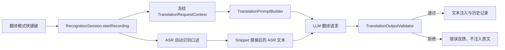

# Type4Me 翻译模式增强开发设计

> 分支：`feat/translation-mode-enhancement`
> 文档类型：开发设计
> 文档状态：当前有效（已实现，持续验证）
> 对应功能设计：`docs/features/translation/product-design.md`
> 设计日期：2026-08-11
> 最后校验：2026-08-11
> 实现基线：`5076296`，错误语言重试修订至 `0bc9bf8`
> 阅读说明：实现分析章节描述改造前基线；功能状态以页首与代码为准

## 1. 设计摘要

本次改造新增一个全新稳定 ID 的内置“翻译模式 / Translation Mode”。该模式不复用、合并或规范化任何旧“英文翻译”或“中文翻译”记录。

核心实现原则：

1. 新内置翻译模式使用独立 ID，永远由 `ModeStorage` 保证存在；
2. 老用户的旧翻译模式按普通用户数据原样保留；
3. 新模式只持久化一个翻译业务配置：目标语言 BCP 47 代码；
4. 源语言不配置，由 ASR 和 LLM 自动识别；
5. 目标语言在录音开始时冻结，异步处理期间不受设置变化影响；
6. Prompt 由统一 Builder 动态构造，所有语言共享同一套边界和保护规则；
7. 翻译失败或明显输出错误语言时不注入 ASR 原文；
8. 新安装默认绑定 `fn + 左 Shift` 和 `⌥ + 2`，老用户升级新增模式时不自动绑定快捷键。

## 2. 当前实现分析

### 2.1 模式模型

`ProcessingMode` 当前直接保存：

- 稳定 ID；
- 名称、描述、Prompt 和处理文案；
- `isBuiltin`；
- 多个 `HotkeyBinding`；
- 短文本跳过阈值；
- 执行类型。

当前模型没有源语言、目标语言或翻译配置抽象。所谓“英文翻译”和“中文翻译”只是两个 `isBuiltin == false` 的默认 Prompt 模式。

### 2.2 模式加载

`ModeStorage.load()` 当前包含三类行为：

1. 无有效文件时返回 `ProcessingMode.defaults`；
2. 对已知内置模式用代码定义规范化，同时保留部分用户字段；
3. 通过 UserDefaults 一次性补入可删除默认模式。

“中文翻译”使用 `tf_translateToChineseModeSeeded` 补入。该标记属于 Bundle，而 `modes.json` 是 DEV 和正式版共享文件，因此不能可靠代表模式当前是否存在。

### 2.3 LLM Prompt

普通录音模式通过 `RecognitionSession.promptForCurrentMode()` 获取 Prompt。除 Intelli Sense 外，当前实现只是：

```swift
promptContext.expandContextVariables(currentMode.prompt)
```

LLM Client 再将 `{text}` 替换为本次 ASR 文本。

翻译目标必须在请求开始前加入 Prompt，不能在 UI 改变后影响已经运行的停止后 final 或同步 LLM 请求。

### 2.4 设置界面

`ModesSettingsTab.modeDetail(_:)` 当前按以下方式分流：

- Intelli Sense 专用详情；
- 大多数内置模式使用 `builtinModeDetail`；
- 语音润色使用专用详情；
- 其余可编辑模式使用 `ModeDetailInner`。

新翻译模式需要在通用内置分支之前增加专用详情视图。

## 3. 总体架构



新增或调整的核心组件：

| 组件 | 职责 |
|---|---|
| `TranslationLanguage` | 支持语言的稳定代码、UI 名称、Prompt 名称和检测映射 |
| `ProcessingMode.translation` | 新内置模式规范定义 |
| `TranslationPromptBuilder` | 使用冻结目标语言构建统一 Prompt |
| `TranslationRequestContext` | 冻结单次录音的目标语言和 Prompt |
| `TranslationOutputValidator` | 检查空输出、工具结构和明显错误语言 |
| `ModeStorage` | 幂等补入新内置模式并保护所有旧翻译记录 |
| `TranslationModeDetail` | 目标语言下拉选择与说明 |

## 4. 稳定标识与命名

### 4.1 新模式 ID

新增：

```swift
static let translationModeId = UUID(
    uuidString: "00000000-0000-0000-0000-00000000000B"
)!
```

该 ID 不与以下旧 ID 建立替换关系：

- 旧 `translateId`：`00000000-0000-0000-0000-000000000003`；
- 当前“英文翻译”默认 ID：`87AF4048-83C3-4306-8AF8-1E52DB7CA2F5`；
- 旧“中文翻译”ID：`92D95CBA-423A-4286-98A9-5E86ECEFEFE7`。

旧 ID 继续作为用户记录 ID 读取，不映射为 `translationModeId`。

### 4.2 默认快捷键 Binding ID

新安装使用两个独立稳定 Binding ID：

```swift
private static let translationOption2BindingId = UUID(
    uuidString: "10000000-0000-0000-0000-000000000008"
)!
private static let translationFnShiftBindingId = UUID(
    uuidString: "10000000-0000-0000-0000-00000000000B"
)!
```

这两个 Binding 仅进入新安装的 `defaults`，不进入老用户补入使用的无快捷键 seed。

### 4.3 用户可见命名

```swift
name: L("翻译模式", "Translation Mode")
description: L(
    "自动识别口述语言并翻译为目标语言",
    "Automatically detect spoken language and translate it to your target language"
)
processingLabel: L("翻译中", "Translating")
```

模式名称不随目标语言改变。

## 5. 数据模型

### 5.1 TranslationLanguage

新增文件建议：

`Type4Me/Models/TranslationLanguage.swift`

```swift
enum TranslationLanguage: String, Codable, CaseIterable, Identifiable, Sendable {
    case english = "en"
    case simplifiedChinese = "zh-Hans"
    case traditionalChinese = "zh-Hant"
    case japanese = "ja"
    case korean = "ko"
    case spanish = "es"
    case french = "fr"
    case german = "de"
    case brazilianPortuguese = "pt-BR"
    case italian = "it"
    case russian = "ru"
    case arabic = "ar"
    case hindi = "hi"
    case thai = "th"
    case vietnamese = "vi"
    case indonesian = "id"
    case turkish = "tr"
    case dutch = "nl"

    var id: String { rawValue }
    var displayName: String { ... }
    var promptName: String { ... }
    var naturalLanguageIdentifiers: Set<String> { ... }
}
```

约束：

- `rawValue` 是持久化协议，不随 UI 文案变化；
- `displayName` 使用 `L` 返回应用内本地化名称；
- `promptName` 使用固定英文名称，例如 `Chinese (Simplified)`，避免 Prompt 随 UI 语言改变；
- 列表顺序由 `allCases` 明确控制；
- 不使用旗帜作为语言标识。

### 5.2 ProcessingMode 字段

为 `ProcessingMode` 增加一个窄范围可选字段：

```swift
var translationTargetLanguageCode: String?
```

选择可选字符串而不是直接使用 `TranslationLanguage` 的原因：

1. 非翻译模式不需要该配置；
2. 能保留未来版本写入但当前版本暂不支持的语言代码；
3. 解码旧 `modes.json` 时缺失字段自然得到 `nil`；
4. 设置界面可以区分“缺失使用默认值”和“存在未知值”；
5. 避免把单个配置拆到 Bundle UserDefaults。

`CodingKeys`、初始化器、解码和编码同步加入该字段：

```swift
translationTargetLanguageCode = try container.decodeIfPresent(
    String.self,
    forKey: .translationTargetLanguageCode
)
```

其他模式保持 `nil`。

### 5.3 规范模式工厂

需要区分新安装和升级补入的快捷键策略：

```swift
static func translation(
    target: TranslationLanguage = .english,
    hotkeyBindings: [HotkeyBinding] = []
) -> ProcessingMode

static var translationForFreshInstall: ProcessingMode {
    translation(
        target: .english,
        hotkeyBindings: [
            HotkeyBinding(
                id: translationFnShiftBindingId,
                keyCode: 56,
                modifiers: 8388608,
                style: .toggle
            ),
            HotkeyBinding(
                id: translationOption2BindingId,
                keyCode: 19,
                modifiers: 524288,
                style: .toggle
            )
        ]
    )
}
```

`keyCode: 56 + Fn` 对应 `fn + 左 Shift`，`keyCode: 19 + Option` 对应 `⌥ + 2`。

## 6. 默认模式集合

### 6.1 Builtins

将无默认快捷键版本加入：

```swift
static var builtins: [ProcessingMode] {
    [
        .direct,
        .intelliSense,
        .translation(),
        .selectionAsk,
        .macAction,
        .formalWriting,
    ]
}
```

`builtins` 中的翻译模式不携带默认快捷键，因为该数组同时用于给已有模式文件补入新内置模式。

### 6.2 Defaults

新安装默认列表移除旧 `.translate`、`.translateToChinese` 和 `.commandMode`，加入：

```swift
.translationForFreshInstall
```

完整默认顺序为：

```swift
[
    .direct,
    .intelliSense,
    .translationForFreshInstall,
    .selectionAsk,
    .macAction,
    .formalWriting,
    .promptOptimize,
    .agentMode,
]
```

对应快捷键为：快速模式 `fn`；智能感知 `fn + 左 Control`、`⌥ + 1`；翻译模式 `fn + 左 Shift`、`⌥ + 2`；随便问 `fn + Space`、`⌥ + 3`；Mac 操作 `⌥ + 4`；语音润色 `⌥ + 5`；Prompt 优化和代办模式无默认快捷键。

### 6.3 旧模式定义

旧 `.translate`、`.translateToChinese` 和相关 Prompt 常量暂时保留，用于：

- 兼容测试；
- 识别旧稳定 ID；
- 必要时展示或调试旧记录。

但它们不再进入 `defaults` 或 `builtins`，也不再被新版 Prompt 迁移逻辑覆盖。

## 7. ModeStorage 迁移设计

### 7.1 基本原则

新版迁移是“保留旧记录 + 补入新内置记录”，不是“把旧记录转成新记录”。

对旧翻译记录禁止：

- 改 ID；
- 替换 Prompt；
- 改名称、描述或处理文案；
- 改快捷键；
- 改排序；
- 改 `isBuiltin`；
- 合并或删除记录。

### 7.2 停止旧 Prompt 迁移

当前以下分支会规范化旧翻译数据，需要删除或改为直接保留：

```swift
if mode.id == ProcessingMode.translateId {
    return migrateDefaultMode(mode, fallback: .translate)
}

if mode.id == ProcessingMode.translate.id {
    return migrateSeededDefaultPrompt(...)
}
```

替换为：

```swift
if ProcessingMode.legacyTranslationModeIDs.contains(mode.id) {
    return mode
}
```

该判断必须位于未知 `isBuiltin` 记录过滤之前，避免非常旧的内置翻译记录被删除。

`legacyTranslationModeIDs` 至少包括前述三个旧 ID。

### 7.3 规范化新内置翻译

已有新模式记录加载时，只规范系统拥有的字段，并保留允许用户配置的字段：

```swift
if mode.id == ProcessingMode.translationModeId {
    var canonical = ProcessingMode.translation()
    canonical.hotkeyBindings = mode.hotkeyBindings
    canonical.translationTargetLanguageCode =
        mode.translationTargetLanguageCode ?? TranslationLanguage.english.rawValue
    return canonical
}
```

需要保留未知但非空的目标代码，不能因为当前版本无法识别而自动改成英语。

系统拥有字段包括：

- 名称；
- 描述；
- Prompt；
- `isBuiltin`；
- 处理文案；
- `shortTextExemption == 0`；
- `executionKind == .recording`。

用户拥有字段包括：

- `hotkeyBindings`；
- `translationTargetLanguageCode`。

### 7.4 老用户首次补入

`ModeStorage` 继续使用内置模式缺失检查，不新增 translation 专属一次性 UserDefaults 标记。

当现有文件缺少 `translationModeId` 时：

1. 创建 `.translation()`，默认无快捷键；
2. 根据最后选择模式决定初始目标语言；
3. 追加到 `result` 末尾；
4. 原子保存完整数组；
5. 下次加载通过稳定 ID 识别，不重复创建。

初始目标语言：

```swift
if lastSelectedModeID == ProcessingMode.translateToChineseId {
    target = .simplifiedChinese
} else {
    target = .english
}
```

不因“文件里只存在中文翻译”自动推断目标语言，避免一个从未使用过的旧 seed 改变新模式默认行为。

为了测试最后选择状态，建议给 `ModeStorage` 注入：

```swift
let userDefaults: UserDefaults
```

这里读取 UserDefaults 只用于一次性的初始目标偏好，不用于决定新内置模式是否存在。模式存在性始终由 `modes.json` 中的新稳定 ID 决定。

### 7.5 停止中文翻译一次性 seed

从 `seededDefaults` 中删除：

```swift
(.translateToChinese, "tf_translateToChineseModeSeeded")
```

旧 `tf_translateToChineseModeSeeded` 无需主动删除；新版忽略它。已有中文翻译记录由普通记录加载路径保留，没有该记录也不再重新补入。

### 7.6 并发和多 Bundle

当前 DEV 与正式版共享 `modes.json`。本次至少保证：

- 新内置模式存在性不依赖 Bundle UserDefaults；
- 写入继续使用 `.atomic`；
- 每次保存前以当前加载结果为基础；
- 重复加载和重复迁移不会创建多个新 ID；
- 旧 App 写回不认识的新模式时，因新模式 `isBuiltin == true` 可能存在兼容风险，应在发布验证中覆盖正式版与 DEV 交替运行。

如果需要彻底解决多进程陈旧快照覆盖，后续应为 ModeStorage 增加文件级版本或协调写入。本次不扩大到通用存储并发重构。

## 8. Prompt 构建

### 8.1 新组件

新增：

`Type4Me/Services/TranslationPromptBuilder.swift`

```swift
enum TranslationPromptBuilder {
    static let baseTemplate = "..."

    static func prompt(target: TranslationLanguage) -> String {
        baseTemplate
            .replacingOccurrences(
                of: "{target_language_name}",
                with: target.promptName
            )
            .replacingOccurrences(
                of: "{target_language_code}",
                with: target.rawValue
            )
    }
}
```

`baseTemplate` 保留 `{text}`，由现有 LLM Client 使用本次 ASR 文本替换。

### 8.2 Prompt 结构

Prompt 至少包含：

1. 目标语言名称和代码；
2. 自动识别源语言；
3. 只翻译、不回答、不执行；
4. 输入与目标语言相同时只做保守清理；
5. 混合语言和标准术语规则；
6. 明确改口处理；
7. 代码、路径、URL、邮箱、标识符和数值保护；
8. 列表与段落结构保护；
9. Prompt 注入边界；
10. 只输出最终文本。

建议数据边界：

```text
<user_input>
{text}
</user_input>
```

禁止把 UI 本地化语言名称直接拼入 Prompt。Prompt 使用固定英文规范名称和 BCP 47 code，保证同一目标在中英文 UI 下得到同一请求。

### 8.3 不使用上下文变量

新翻译模式不读取：

- 当前选中文本；
- 剪贴板；
- App 上下文；
- Intelli Sense 表达习惯。

在 `startRecording` 中与 Intelli Sense 类似，将 `promptContext` 设为空，避免不必要的 Accessibility 读取和临时复制回退。

## 9. 单次请求冻结

### 9.1 TranslationRequestContext

在 `RecognitionSession` 中新增：

```swift
private struct TranslationRequestContext: Sendable {
    let generation: Int
    let targetLanguageCode: String
    let prompt: String
}

private var translationRequestContext: TranslationRequestContext?
```

录音开始时：

1. 从 `effectiveMode.translationTargetLanguageCode` 读取代码；
2. 解析为 `TranslationLanguage`；
3. 构建并冻结 Prompt；
4. 记录当前 `sessionGeneration`；
5. 发送动态处理文案所需语言信息。

目标语言无效时，在启动 ASR 前返回用户可见错误，避免录完后才发现配置不可用。

### 9.2 promptForCurrentMode

增加翻译分支：

```swift
if currentMode.id == ProcessingMode.translationModeId,
   let context = translationRequestContext,
   context.generation == sessionGeneration {
    return context.prompt
}
```

Intelli Sense 逻辑保持不变，其他模式继续使用 `PromptContext`。

### 9.3 清理生命周期

以下路径必须清空 `translationRequestContext`：

- 新录音开始前；
- 正常完成；
- 取消录音；
- ASR 错误；
- LLM 超时或失败；
- recovery 中断；
- `forceReset()`；
- session generation 变化。

### 9.4 设置变化与跨快捷键

设置页修改目标语言只更新 `availableModes` 中的持久化模式，不更新正在运行 actor 内的冻结上下文。

同一翻译模式的另一个快捷键结束录音时，即使 UI 设置已经变化，也继续使用启动时目标。

对于真正的跨模式结束：

- 从其他模式切换到翻译模式处理：在 `switchMode(to:)` 时创建翻译上下文；
- 从翻译模式切换到其他模式处理：清空翻译上下文；
- 翻译模式切换到同一 ID：保留原冻结上下文。

## 10. 动态处理状态

模式存储中的 `processingLabel` 保持稳定的“翻译中 / Translating”。

录音停止进入处理时，通过现有：

```swift
.processingLabelOverride(String)
```

显示：

```swift
L(
    "正在翻译为\(target.displayName)…",
    "Translating to \(target.displayName)…"
)
```

该文案使用冻结目标语言，而不是设置页当前值。

`AppState.startRecording()` 已会清理上次 override，无需新增全局状态。

## 11. 输出校验

### 11.1 Validator 接口

新增：

`Type4Me/Services/TranslationOutputValidator.swift`

```swift
enum TranslationValidationDecision: Equatable {
    case accept
    case acceptWithWarning(TranslationValidationWarning)
    case reject(TranslationValidationFailure)
}

enum TranslationValidationAction: Equatable {
    case accept
    case retry
    case reject(TranslationValidationFailure)
}

protocol TranslationLanguageDetecting: Sendable {
    func hypotheses(for text: String) -> [String: Double]
}
```

生产实现使用 macOS `NaturalLanguage.NLLanguageRecognizer`，测试注入固定 detector。

### 11.2 校验顺序

1. 空或纯空白输出：拒绝；
2. 包含 `<tool_call>` 等工具调用结构：拒绝；
3. 包含明显解释性前言且没有实质译文：拒绝；
4. 清理代码块、URL、路径、邮箱、标识符和纯数字后统计自然语言字符；
5. 文本过短或检测置信度不足：带 warning 接受；
6. 目标语言命中或位于高概率候选：接受；
7. 另一语言高置信度占优且目标概率极低：第一次请求重试，重试仍不匹配则拒绝；
8. 其他不确定情况：带 warning 接受。

Validator 继续用 warning 表达语言检测证据，独立的 `TranslationValidationPolicy` 将它转换为产品动作。只有高置信度错误语言从首次 warning 升级为一次 retry；第二次仍出现同类 warning 时升级为 reject。短文本和低置信度 warning 始终接受。错误语言必须同时满足：

- 可检测自然语言字符不少于 12；
- 非目标语言置信度不低于 `0.90`；
- 目标语言置信度不高于 `0.03`。

错误语言阈值为置信度不低于 `0.90`、目标语言置信度不高于 `0.03`。阈值必须集中定义并通过测试调整，不散落在 Session 中。空输出和工具调用结构不经过重试，始终立即拒绝。

### 11.3 错误语言重试

首次高置信度语言不匹配时：

1. 不注入首次候选；
2. 使用完整最终 ASR（包含已应用的 snippet replacement）重新请求一次；
3. 使用 `TranslationPromptBuilder.retryPrompt(target:)` 强调上次输出语言错误；
4. 重试成功且校验通过后才继续注入；
5. 重试仍为高置信度错误语言时抛出 `TranslationError.unexpectedLanguage`；
6. 重试请求失败或超时按 `llmUnavailable` 处理；
7. 两次 LLM 耗时累加到同一条历史记录。

### 11.4 简繁中文

`zh-Hans` 和 `zh-Hant` 分别映射到 NaturalLanguage 对应标识。短文本或简繁共用字符较多时不得强拒绝，只记录 warning。

### 11.5 混合和技术文本

代码、路径和品牌词会显著干扰语言检测，因此 validator 只检查清理后的自然语言主体。

无法可靠判断时优先接受，避免把正确的技术翻译误报为失败。Validator 的目标是拦截“整段明显输出错误语言”，不是证明翻译质量。

## 12. LLM 失败与注入控制

### 12.1 当前问题

普通模式在 LLM 失败时回落到 ASR 原文并继续注入。对翻译模式而言，这会把源语言文本误当作译文粘贴，违反产品语义。

### 12.2 特殊失败策略

当 `currentMode.id == translationModeId` 时，以下情况必须终止注入：

- 没有 LLM 配置；
- LLM 请求失败；
- 超时；
- 空输出；
- validator 拒绝；
- 错误语言重试后仍不匹配；
- 目标语言配置无效。

统一返回 `TranslationError`，例如：

```swift
enum TranslationError: LocalizedError {
    case unsupportedTarget(String)
    case llmUnavailable
    case emptyOutput
    case unexpectedOutputLanguage
    case unsafeOutput
}
```

### 12.3 Session 收敛

建议抽出：

```swift
private func failTranslation(
    _ error: TranslationError,
    rawText: String,
    ...
) async
```

职责：

- 不调用 injection engine；
- 保存历史记录中的 raw text；
- processed text 设为 `nil`；
- 标记 LLM 失败；
- 发出 `.error(error)` 和 `.completed`；
- 清理 target context、任务和 hotkey processing 状态；
- 恢复系统音量。

其他模式的现有 raw-text fallback 保持不变。

### 12.4 Final 与同步路径一致

当前 final LLM 和同步 LLM 有两套结果分支。翻译输出必须进入同一个 helper：

```swift
private func resolveTranslationOutput(
    candidate: String?,
    context: TranslationRequestContext
) throws -> String
```

避免 final 路径执行 validator，而同步路径漏掉，或一条路径仍回落原文。

## 13. 设置界面实现

### 13.1 分流

在 `modeDetail(_:)` 最前面加入：

```swift
if mode.id == ProcessingMode.translationModeId {
    translationModeDetail(mode)
} else if mode.id == ProcessingMode.intelliSenseId {
    ...
}
```

### 13.2 TranslationModeDetail

建议新增私有或独立 View：

```swift
private struct TranslationModeDetail: View {
    let mode: ProcessingMode
    let onTargetChange: (String) -> Void
    let onEditBinding: (HotkeyBinding) -> Void
    let onDeleteBinding: (HotkeyBinding) -> Void
    let onAddBinding: () -> Void
}
```

页面包含：

- `globe` 或 `character.book.closed.fill` 图标；
- 内置标签；
- 系统描述；
- `Picker` 目标语言下拉框；
- “自动识别你的口述语言”辅助文案；
- 通用 `HotkeySectionView`；
- 使用说明。

### 13.3 持久化更新

Picker 变化时：

1. 按 `translationModeId` 找到 `modes` 中记录；
2. 只修改 `translationTargetLanguageCode`；
3. 调用现有 `persistModes()`；
4. 更新 `appState.availableModes`；
5. 发出 `.modesDidChange`；
6. 如果当前选中模式是翻译模式，更新静态模式快照，但不影响运行中的 Session 冻结上下文。

### 13.4 未知语言代码

如果代码不能解析为当前 `TranslationLanguage`：

- Picker 显示“暂不支持的语言”；
- 展示警告；
- 用户选择有效语言后覆盖该代码；
- 不在页面首次打开时自动写回英语。

### 13.5 旧翻译模式 UI

旧“英文翻译”和“中文翻译”继续进入 `ModeDetailInner`：

- 仍可编辑；
- 仍可删除；
- 仍显示原名称和 Prompt；
- 不增加自动“旧版”后缀；
- 不隐藏；
- 不将其详情替换为新版目标语言 Picker。

判断只能使用新 `translationModeId`，不得按模式名称或 Prompt 内容判断。

## 14. 快捷键与运行时注册

现有 `HotkeyManager` 已按 `mode.hotkeyBindings` 展开多个绑定，新模式不需要新的注册协议。

需要验证：

- 新安装 `fn + 左 Shift` 和 `⌥ + 2` 正常注册；
- 老用户旧英文翻译仍占用 `⌥ + 3` 时，新模式无默认绑定，不发生冲突；
- 用户在新模式详情添加已占用快捷键时，沿用现有冲突确认流程；
- 同模式多个 binding 都解析到同一个 `translationModeId`；
- target 设置变化后重新注册不会改变 binding ID；
- cross-mode finish 的 target 冻结语义符合第 9.4 节。

## 15. 历史记录与可观测性

### 15.1 历史记录

现有 HistoryStore 继续记录：

- `rawText`：ASR 原文；
- `processedText`：成功译文；
- `processingMode`：稳定显示名称“翻译模式”；
- LLM provider、model 和耗时。

建议同时增加可选目标语言字段，便于历史详情解释输出方向：

```swift
targetLanguageCode: String?
```

如果本次不扩展 History schema，至少在 debug log 中记录 target code。该字段不应成为功能上线的阻塞项，但开发时应优先评估低成本迁移。

旧翻译模式的历史名称不回写或重命名。

### 15.2 日志

日志只记录元数据，不记录额外全文：

```text
translation start target=en generation=42
translation validation decision=accept detected=en confidence=0.93
translation failed reason=unexpectedOutputLanguage target=ja detected=en
```

不得因为调试新增源文本或完整译文日志。

## 16. 测试设计

### 16.1 TranslationLanguageTests

- 18 个 code 唯一且顺序稳定；
- 中英文显示名称；
- Prompt 名称不受 App 语言影响；
- 编码、解码 round trip；
- 简繁中文分别映射；
- 未知 code 不自动变成英语。

### 16.2 ProcessingModeTests

- 新 translation ID 与所有旧 ID 不同；
- 新模式 `isBuiltin == true`；
- fresh factory 有 `fn + 左 Shift` 和 `⌥ + 2`；
- upgrade factory 无快捷键；
- `shortTextExemption == 0`；
- target code 正确编码；
- 旧 JSON 缺字段仍可解码。

### 16.3 ModeStorageTests

迁移矩阵至少包括：

| 输入 | 期望 |
|---|---|
| 无 modes 文件 | defaults 只有一个新官方翻译模式，目标英语，绑定 `fn + 左 Shift` 和 `⌥ + 2` |
| 只有旧英文翻译 | 旧记录逐字段相等，新模式追加且无快捷键 |
| 只有旧中文翻译 | 旧记录逐字段相等，新模式追加且无快捷键 |
| 两个旧模式都有 | 两条旧记录和顺序不变，只追加一个新模式 |
| 旧 Prompt 被修改 | 自定义 Prompt 完整保留 |
| 只修改名称 | 名称完整保留 |
| 多快捷键 | binding ID、顺序、style 和 modifiers 完整保留 |
| 最后选择旧中文 | 新模式初始 target 为 `zh-Hans` |
| 最后选择其他模式 | 新模式初始 target 为 `en` |
| 已有新模式 | 不重复追加，保留 target 与快捷键 |
| 新模式记录被删 | 下一次 load 恢复无快捷键新模式 |
| 未知 target code | 原 code 保留，UI 后续处理 |
| 旧 seed flag 为 true/false | 不影响新模式存在性 |
| 连续 load 两次 | 第二次结果与第一次相同 |

测试“原样保留”采用 `ProcessingMode` 全字段语义相等，不使用 Prompt 模糊匹配。

### 16.4 TranslationPromptBuilderTests

- 每个语言正确注入 name 和 code；
- UI 语言变化不改变 Prompt；
- `{text}` 只保留一个数据占位；
- 包含不回答、不执行和内容保护规则；
- 输入边界不会二次展开用户文本中的变量。
- retry Prompt 明确强化目标语言且只保留一个 `{text}` 占位符。

### 16.5 TranslationOutputValidatorTests

- 正确目标语言接受；
- 高置信度错误语言第一次要求重试，第二次拒绝；
- 短文本不误拒；
- 混合技术词不误拒；
- URL、路径、代码和数字不主导检测；
- 简繁中文短文本降级 warning；
- 空输出和工具结构拒绝；
- detector 不确定时接受并记录 warning。

### 16.6 RecognitionSessionTests

- 目标语言在录音开始时冻结；
- 处理中修改设置不改变 Prompt；
- 同模式另一快捷键结束仍用冻结 target；
- final 和同步路径使用相同 validator；
- 错误语言重试使用完整最终输入且最多一次；
- 重试成功后正常注入，重试仍不匹配时写入 `translation_error`；
- LLM 失败不注入 ASR 原文；
- validator 拒绝不注入；
- 其他模式仍保持原有 fallback；
- target 无效时不启动 ASR；
- cancel、error、forceReset 清理 context；
- 动态 processing label 使用冻结 target。

### 16.7 UI 与集成验证

- 目标语言 Picker 修改并持久化；
- 重启后恢复；
- 内置模式无删除和 Prompt 编辑；
- 旧模式仍显示原详情；
- VoiceOver 标签完整；
- 目标语言长名称不破坏布局；
- DEV 与正式版交替启动后新旧模式均保留；
- 全量 `swift test`；
- DEV 签名、安装与真实语音冒烟验证。

## 17. 文件改动清单

预计新增：

- `Type4Me/Models/TranslationLanguage.swift`
- `Type4Me/Services/TranslationPromptBuilder.swift`
- `Type4Me/Services/TranslationOutputValidator.swift`
- `Type4MeTests/TranslationLanguageTests.swift`
- `Type4MeTests/TranslationPromptBuilderTests.swift`
- `Type4MeTests/TranslationOutputValidatorTests.swift`

预计修改：

- `Type4Me/UI/AppState.swift`
- `Type4Me/Services/ModeStorage.swift`
- `Type4Me/Session/RecognitionSession.swift`
- `Type4Me/UI/Settings/ModesSettingsTab.swift`
- `Type4Me/UI/Settings/HomeDashboardView.swift`
- `Type4MeTests/ModeStorageTests.swift`
- `Type4MeTests/RecognitionSessionTests.swift`
- 可能涉及 `Type4Me/Database/HistoryStore.swift`
- 可能涉及 History schema 测试

## 18. 实施顺序

建议按以下顺序实施：

1. 新增 `TranslationLanguage` 和数据模型字段；
2. 定义新稳定 ID、fresh/upgrade 两种模式工厂；
3. 修改 defaults、builtins 和 ModeStorage 迁移；
4. 先完成数据保护测试，确认旧记录零覆盖；
5. 实现 TranslationPromptBuilder；
6. 实现 TranslationRequestContext 和 Session 冻结；
7. 实现目标语言 Picker 与持久化；
8. 实现 output validator；
9. 收敛 LLM 失败路径并禁止 raw fallback；
10. 补充 History 元数据或日志；
11. 完成全量自动化测试；
12. 安装 DEV 构建进行真实翻译冒烟测试。

数据迁移测试必须早于 UI 和 Prompt 实现，避免开发后期才发现旧用户记录会被规范化覆盖。

## 19. 发布与回滚

### 19.1 发布前检查

- 备份真实用户 `modes.json` 样本并进行离线迁移测试；
- 覆盖 Prompt 被修改、名称被修改、多快捷键和乱序模式；
- 检查旧 `tf_translateToChineseModeSeeded` 的各种状态；
- 确认新 ID 未与历史版本冲突；
- 确认正式版和 DEV 版都能读取新字段；
- 确认旧版 App 读取带新字段 JSON 时不会解码失败。

### 19.2 回滚要求

因为旧翻译模式未被删除或改写，版本回滚后：

- 旧英文/中文翻译仍可继续使用；
- 旧版可能把新内置翻译视为未知内置模式并过滤，但不影响旧记录；
- 再次升级时由新稳定 ID 恢复或规范化新模式；
- 目标语言字段被旧 decoder 忽略，不影响其他模式。

这也是不复用旧英文翻译 ID 的关键收益：新功能回滚不会破坏用户原有翻译工作流。

## 20. 完成定义

开发完成必须同时满足：

1. 功能设计中的验收标准全部覆盖；
2. 新翻译模式使用全新稳定 ID；
3. 所有旧翻译记录在迁移前后全字段语义一致；
4. 新安装和老用户快捷键策略不同且测试固定；
5. 目标语言设置跨重启稳定；
6. Prompt 对所有语言共享同一规则；
7. 目标语言在请求级冻结；
8. 翻译失败不会注入源语言原文；
9. 全量测试通过；
10. DEV 构建完成签名、安装和真实语音验收。
